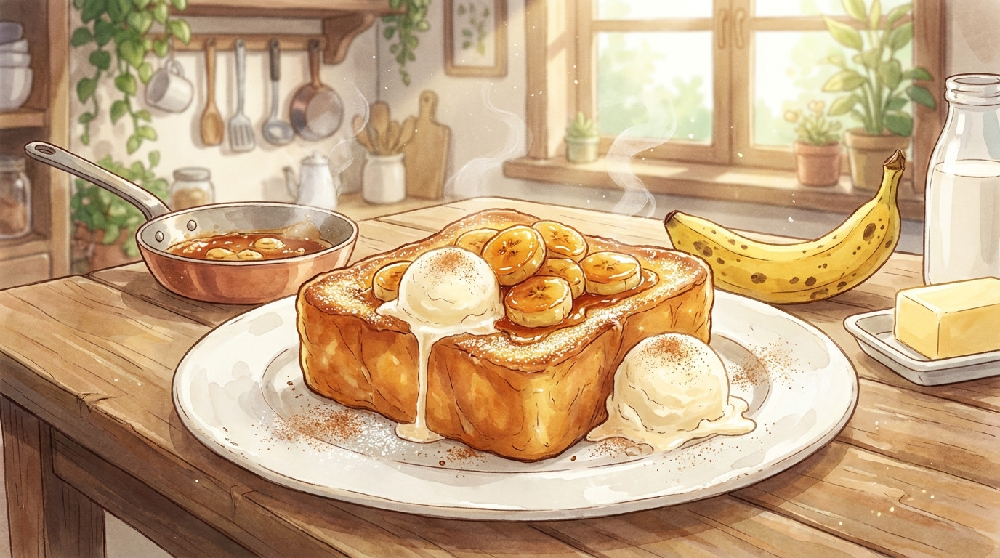

# 바나나 캐러멜 프렌치토스트 (15분)

검게 반점이 생긴 바나나를 처리하는 가장 맛있는 방법. 팬 하나로 캐러멜과 토스트를 모두 해결하기 때문에 설거지도 적다. 겉은 캐러멜라이즈되어 바삭하고 속은 푸딩처럼 촉촉하다.

- **소요 시간**: 15분 (준비 5분 + 조리 10분)
- **분량**: 1~2인분 (식빵 2장)
- **난이도**: 보통

## 재료

| 재료 | 분량 | 메모 |
| --- | --- | --- |
| 두꺼운 식빵 | 2장 | 두께 2.5cm 이상, 하루 지난 것이 더 좋다 |
| 달걀 | 2개 | |
| 우유 | 120ml | |
| 설탕 | 1큰술 | 달걀물용 |
| 바닐라 익스트랙 | 1/2작은술 | 없으면 생략 가능 |
| 소금 | 한 꼬집 | 단맛을 또렷하게 만든다 |
| 버터 | 30g | 토스트용 20g + 캐러멜용 10g |
| 바나나 | 1개 | 반점이 생긴 잘 익은 것 |
| 설탕 | 2큰술 | 캐러멜용 |
| 생크림 또는 우유 | 2큰술 | 캐러멜용 |
| (선택) 바닐라 아이스크림 | 1스쿱 | |
| (선택) 계핏가루 · 슈거파우더 | 약간 | 마무리용 |

## 만드는 법

1. **달걀물 만들기 (0분)** — 볼에 달걀, 우유, 설탕 1큰술, 소금, 바닐라를 넣고 **거품기로 완전히 풀어준다**. 알끈이 남으면 구울 때 흰자 덩어리가 생긴다. 체에 한 번 내리면 확실하다.
2. **식빵 적시기 (3분)** — 넓은 접시에 달걀물을 붓고 식빵을 담근다. 한 면당 2분씩, 총 4분. 젓가락으로 눌렀을 때 스펀지처럼 묵직해야 한다. 얇은 식빵이면 한 면당 30초로 줄인다.
3. **바나나 자르기 (5분)** — 바나나를 길게 반 가르거나 1cm 두께로 어슷 썬다. 길게 자르면 모양이 예쁘고, 썰면 골고루 캐러멜이 묻는다.
4. **토스트 굽기 (7분)** — 팬에 버터 20g을 녹이고 **중약불**에서 식빵을 굽는다. 한 면당 3분씩, 진한 황금색이 날 때까지. 센 불에 구우면 겉만 타고 속은 달걀물이 익지 않는다. 다 구워지면 접시에 옮긴다.
5. **캐러멜 만들기 (12분)** — 같은 팬을 닦지 말고 중불로 올려 설탕 2큰술을 뿌린다. 젓지 말고 팬을 흔들어가며 30~40초, 가장자리부터 갈색으로 녹기 시작하면 버터 10g과 생크림을 넣고 재빨리 섞는다.
6. **바나나 조리고 완성 (15분)** — 캐러멜에 바나나를 넣고 30초만 굴려 코팅한다. 오래 두면 뭉개진다. 토스트 위에 바나나와 캐러멜을 붓고, 아이스크림을 올린 뒤 계핏가루와 슈거파우더를 뿌린다.

## 성공 포인트

- **식빵은 두꺼울수록 좋다.** 얇은 식빵은 달걀물을 머금으면 찢어진다. 마트 식빵이라면 두 장을 겹치지 말고 두께 2.5cm 이상 제품을 고른다.
- **하루 지난 식빵이 더 맛있다.** 살짝 마른 빵이 달걀물을 훨씬 잘 빨아들인다. 갓 산 식빵이라면 토스터에 살짝 굽거나 실온에 30분 두었다 쓴다.
- **캐러멜 설탕은 절대 젓지 않는다.** 주걱으로 저으면 설탕이 재결정화되어 서걱거리는 알갱이가 생긴다. 팬을 돌려가며 녹인다.
- **생크림은 실온에 둔다.** 차가운 크림을 뜨거운 캐러멜에 부으면 급격히 굳어 덩어리진다.
- **불은 시종일관 중약불.** 이 레시피에서 센 불이 필요한 순간은 한 번도 없다.

## 응용

- **럼 향 캐러멜** — 5번 단계에서 럼이나 브랜디 1작은술을 넣으면 어른 디저트가 된다.
- **크림치즈 버전** — 식빵 두 장 사이에 크림치즈를 발라 샌드처럼 만든 뒤 달걀물에 적신다.
- **견과류 추가** — 다진 호두나 피칸을 4번 단계에서 팬에 함께 볶아 고소함을 더한다.
- **사과 버전** — 바나나 대신 얇게 썬 사과를 쓰면 캐러멜에 2분 더 조려야 한다. 타르트 타탱 같은 맛이 난다.
- **에어프라이어** — 달걀물에 적신 식빵을 180도 8분(중간에 뒤집기) 구우면 버터를 줄일 수 있다.
