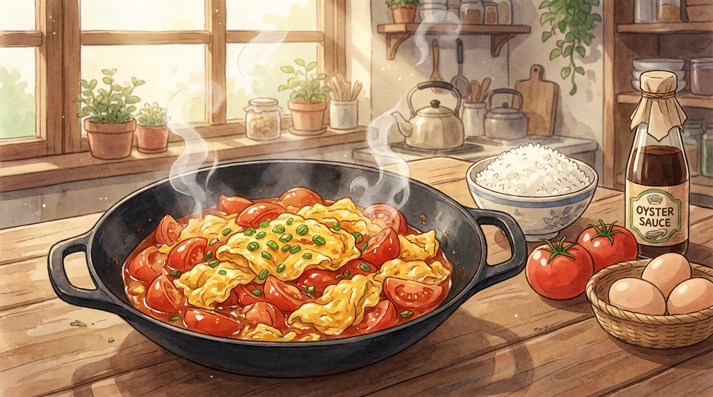

# 토마토 달걀볶음 (12분)

중국 가정식의 국민 반찬, 시홍스차오지단(西红柿炒鸡蛋). 재료는 단 두 가지인데 밥 두 공기가 사라진다. 토마토의 산미와 달걀의 고소함이 만나는 조합.

- **소요 시간**: 12분 (준비 5분 + 조리 7분)
- **분량**: 2인분
- **난이도**: 쉬움

## 재료

| 재료 | 분량 | 메모 |
| --- | --- | --- |
| 완숙 토마토 | 2개 (중간 크기) | 단단한 것보다 무른 것이 맛있다 |
| 달걀 | 3개 | |
| 대파 | 1/2대 | 흰 부분은 볶고 초록은 마무리 |
| 마늘 | 2쪽 | 다진다 |
| 설탕 | 1작은술 | 토마토 신맛을 잡는 핵심 |
| 소금 | 1/2작은술 | 달걀용 1/4 + 볶음용 1/4 |
| 굴소스 | 1작은술 | 없으면 진간장 1작은술 |
| 식용유 | 2큰술 | |
| 참기름 | 1/2작은술 | 마무리용 |
| (선택) 물전분 | 1큰술 | 전분 1작은술 + 물 1큰술 |

## 만드는 법

1. **토마토 손질 (0분)** — 토마토를 큼직하게 6~8등분한다. 껍질이 신경 쓰이면 열십자로 칼집을 내고 끓는 물에 20초 담갔다 찬물에 넣으면 껍질이 손으로 벗겨진다.
2. **달걀 풀기 (3분)** — 달걀에 소금 1/4작은술을 넣고 알끈이 풀릴 때까지 충분히 젓는다. 물 1큰술을 섞으면 훨씬 폭신해진다.
3. **달걀 익히기 (5분)** — 팬을 충분히 달군 뒤 식용유 1큰술을 두르고 **센 불**에 달걀을 붓는다. 가장자리가 부풀면 크게 몇 번만 저어 70%만 익힌 반숙 상태로 즉시 꺼낸다. 여기서 완전히 익히면 나중에 퍽퍽해진다.
4. **토마토 볶기 (7분)** — 같은 팬에 남은 기름을 두르고 대파 흰 부분과 마늘을 10초 볶아 향을 낸 뒤, 토마토를 넣고 중불에서 2~3분 볶는다. 토마토가 허물어지며 붉은 국물이 나올 때까지 기다린다.
5. **간하기 (10분)** — 설탕, 소금, 굴소스를 넣고 섞는다. 국물이 자작하길 원하면 물전분을 둘러 걸쭉하게 만든다.
6. **합치기 (12분)** — 빼두었던 달걀을 다시 넣고 30초만 크게 뒤적인다. 불을 끄고 참기름과 대파 초록 부분을 뿌려 완성.

## 성공 포인트

- **달걀은 두 번에 나눠 익힌다.** 처음에 반숙으로 꺼냈다가 마지막에 합치는 것이 이 요리의 전부다. 한 번에 볶으면 달걀이 토마토 물을 먹고 흐물해진다.
- **설탕은 단맛이 아니라 균형용.** 토마토가 실 때 설탕이 없으면 시큼한 맛만 남는다. 신 토마토라면 1작은술 더.
- **팬은 확실히 달군다.** 미지근한 팬에 달걀을 부으면 눌어붙고 폭신해지지 않는다.
- **토마토는 무를 때까지 기다린다.** 형태가 살아있으면 소스가 안 생겨서 그냥 토마토와 달걀이 따로 논다.

## 응용

- **국물 버전** — 4번 단계에서 물 200ml를 붓고 끓이면 토마토 달걀탕이 된다. 밥 말아 먹기 좋다.
- **면 요리로** — 완성품을 삶은 소면이나 칼국수면에 올리면 훌륭한 한 끼.
- **치즈 추가** — 마지막에 모짜렐라를 올려 뚜껑을 덮고 1분 두면 아이들이 좋아한다.
- **새우 추가** — 3번 단계 전에 칵테일 새우를 볶아 빼두었다가 마지막에 함께 넣는다.
