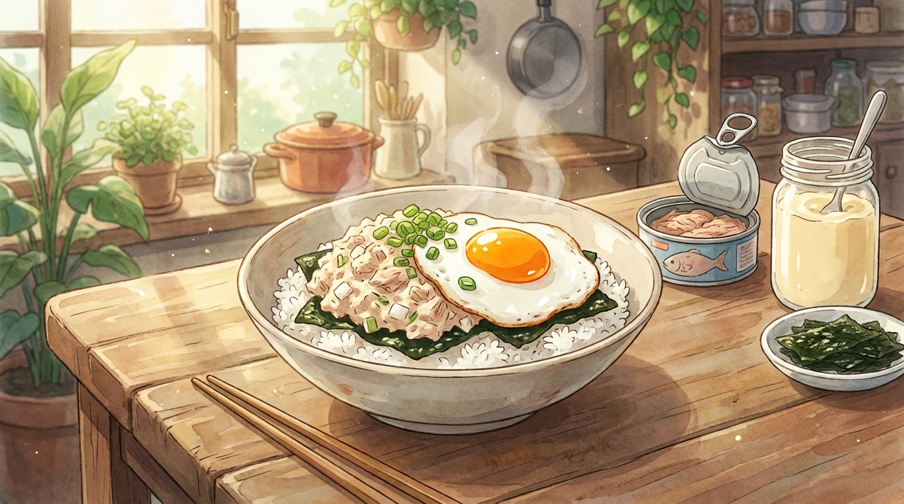

# 참치마요 덮밥 (10분)

편의점에서 사 먹던 그 맛을, 참치캔 하나로 집에서. 불을 거의 쓰지 않기 때문에 자취방에서 가장 실패하기 어려운 한 그릇이다.

- **소요 시간**: 10분 (준비 4분 + 조리 6분)
- **분량**: 1인분
- **난이도**: 아주 쉬움

## 재료

| 재료 | 분량 | 메모 |
| --- | --- | --- |
| 따뜻한 밥 | 1공기 (210g) | 즉석밥도 충분하다 |
| 참치캔 | 1개 (100g) | 기름을 꼭 짜낸다 |
| 마요네즈 | 2큰술 | |
| 설탕 | 1/2작은술 | |
| 진간장 | 1작은술 | 밥 밑간용 |
| 참기름 | 1작은술 | 밥 밑간용 |
| 달걀 | 1개 | 반숙 프라이 |
| 양파 | 1/8개 | 잘게 다져 물에 5분 담근다 |
| 김가루 | 한 줌 | |
| 쪽파 또는 대파 | 약간 | 송송 썰기 |
| (선택) 스리라차 | 1작은술 | 매콤한 마요를 원할 때 |

## 만드는 법

1. **양파 매운맛 빼기 (0분)** — 다진 양파를 찬물에 담가둔다. 이 5분이 아삭함은 남기고 매운맛만 빼주는 시간이다. 그동안 나머지를 준비한다.
2. **참치 기름 짜기 (2분)** — 참치캔 뚜껑을 반쯤 열어 손으로 꾹 눌러 기름을 완전히 빼낸다. 기름이 남으면 마요가 묽어지고 비린내가 돈다.
3. **마요 무침 (4분)** — 볼에 참치, 마요네즈, 설탕, 물기를 꽉 짠 양파를 넣고 섞는다. 참치 살을 너무 으깨지 말고 결이 살아있게 가볍게만 버무린다.
4. **달걀 부치기 (6분)** — 팬에 기름을 두르고 중약불에서 달걀을 노른자가 흐르는 반숙으로 부친다. 흰자 가장자리가 바삭해지면 딱 좋다.
5. **밥 밑간 (8분)** — 뜨거운 밥에 간장과 참기름을 넣고 주걱으로 자르듯 섞는다. 밥알이 뭉개지지 않게 가볍게.
6. **담기 (10분)** — 그릇에 밥을 담고 김가루를 깐 뒤 참치마요를 올린다. 가운데 반숙 달걀을 얹고 쪽파를 뿌린다. 노른자를 터뜨려 비벼 먹는다.

## 성공 포인트

- **기름은 반드시 완전히 뺀다.** 참치마요가 질척해지는 원인의 90%는 남은 기름이다.
- **밥은 뜨거울 때 밑간한다.** 식은 밥에는 간장과 참기름이 스며들지 않고 겉돌기만 한다.
- **김가루는 밥과 참치 사이에.** 위에 뿌리면 금방 눅눅해지지만, 사이에 깔면 마지막까지 향이 산다.
- **마요는 먹기 직전에 무친다.** 미리 만들어두면 양파에서 물이 나와 묽어진다.

## 응용

- **매운 참치마요** — 3번 단계에서 스리라차나 고추장 1/2작은술을 넣는다.
- **삼각김밥 속** — 밥 밑간을 생략하고 참치마요만 김밥용 김에 싸면 그대로 편의점 삼각김밥이다.
- **아보카도 덮밥** — 김가루 위에 얇게 썬 아보카도를 깔면 훨씬 부드럽고 든든해진다.
- **오븐 참치마요** — 밥 위에 참치마요를 덮고 치즈를 올려 에어프라이어 180도 6분이면 그라탕처럼 된다.
