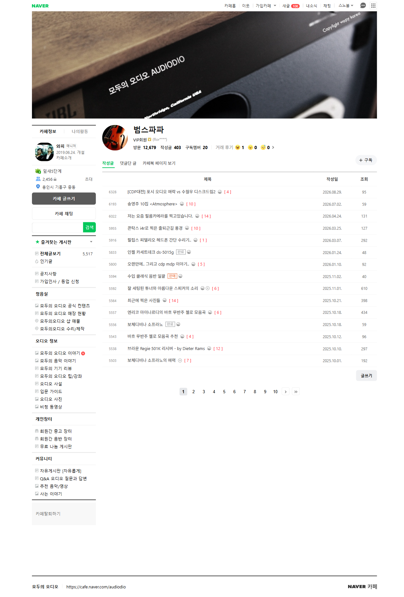
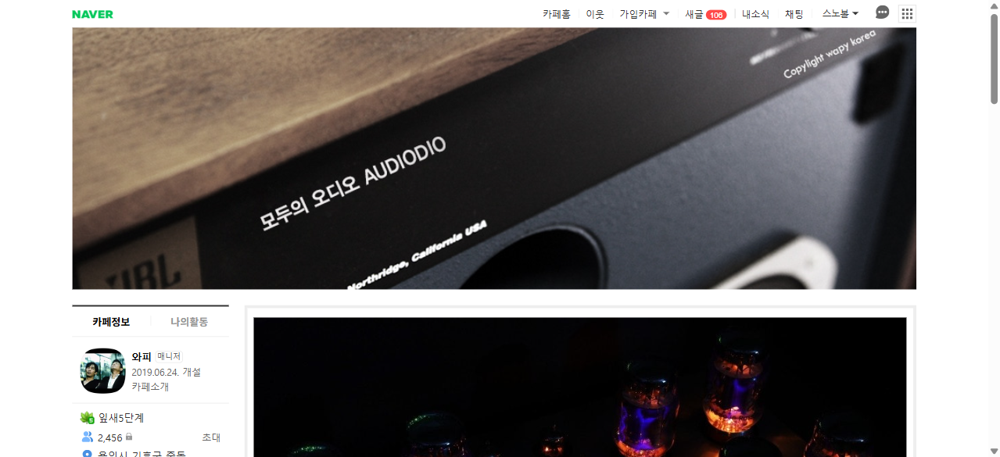
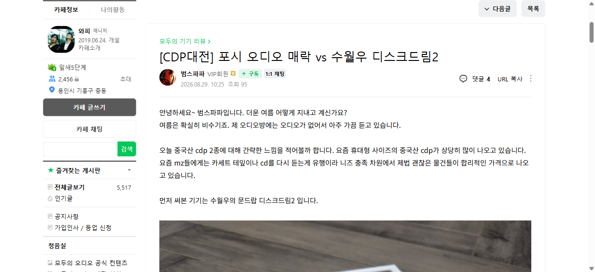

# 모두의 오디오 카페 — "범스파파" 작성글 정리

> Playwright(MCP)로 네이버 카페에 로그인한 상태에서 수집한 결과입니다.
> **수집일: 2026-09-01** · 대상 카페: [모두의 오디오](https://cafe.naver.com/audiodio) (cafeId `29796463`)

---

## 1. 카페 & 멤버 개요



| 항목 | 값 |
|---|---|
| 카페 이름 | 모두의 오디오 (audiodio) |
| 카페 URL | https://cafe.naver.com/audiodio |
| 개설일 / 매니저 | 2019.06.24. / 와피 |
| 카페 등급 · 멤버수 | 잎새5단계 · 2,456명 |
| 전체 게시글 수 | 5,517건 |
| **멤버 닉네임** | **범스파파** (VIP회원, `flor****`) |
| 멤버 프로필 | https://cafe.naver.com/f-e/cafes/29796463/members/m2aZj4sxCuS3IIgKXkqKiW6l0Itb5vJkS9PfzrlH6N0 |
| 방문 / 구독멤버 | 12,679회 / 20명 |
| **수집된 작성글** | **404건** (프로필 표기 403건 + 최신 1건) |
| 활동 기간 | 2019-08-20 ~ 2026-08-29 (약 7년) |
| 누적 조회수 / 댓글수 | 57,324 / 3,604 |
| 글당 평균 조회 / 댓글 | 141.9 / 8.9 |



---

## 2. 게시판별 분포

| 게시판 | 글 수 | 비중 |
|---|---:|---:|
| 모두의 오디오 이야기 | 139 | 34.4% |
| 회원간 중고 장터 | 66 | 16.3% |
| 자유게시판 [자유롭게] | 64 | 15.8% |
| 모두의 음악 이야기 | 52 | 12.9% |
| 비청 동영상 | 31 | 7.7% |
| 모두의 기기 리뷰 | 23 | 5.7% |
| 사는 이야기 | 20 | 5.0% |
| 회원간 음반 장터 | 7 | 1.7% |
| 추천 음악/영상 | 2 | 0.5% |

오디오 기기·음악 감상기(“모두의 오디오 이야기”, “모두의 음악 이야기”, “기기 리뷰”, “비청 동영상”)가 전체의 약 60%를 차지하고, 중고/음반 장터 글이 약 18%로 뒤를 잇습니다.

---

## 3. 연도별 활동량

| 연도 | 글 수 | |
|---|---:|---|
| 2026 | 7 | ██ |
| 2025 | 34 | ███████████ |
| 2024 | 67 | ██████████████████████ |
| 2023 | 100 | █████████████████████████████████ |
| 2022 | 46 | ███████████████ |
| 2021 | 35 | ████████████ |
| 2020 | 100 | █████████████████████████████████ |
| 2019 | 15 | █████ |

2020년과 2023년에 각각 100건으로 활동이 가장 활발했고, 2025년 이후로는 게시 빈도가 눈에 띄게 줄었습니다(2026년 7건).

---

## 4. 최근 글 20건

| 작성일 | 게시판 | 제목 | 댓글 | 조회 |
|---|---|---|---:|---:|
| 2026-08-29 | 모두의 기기 리뷰 | [[CDP대전] 포시 오디오 매락 vs 수월우 디스크드림2](https://cafe.naver.com/audiodio/6328) | 4 | 95 |
| 2026-07-01 | 사는 이야기  | [송영주 10집 \<Atmosphere\>](https://cafe.naver.com/audiodio/6193) | 10 | 59 |
| 2026-04-24 | 사는 이야기  | [저는 요즘 필름카메라를 찍고있습니다.](https://cafe.naver.com/audiodio/6022) | 14 | 131 |
| 2026-03-25 | 사는 이야기  | [콘탁스 i4r로 찍은 출퇴근길 풍경](https://cafe.naver.com/audiodio/5955) | 10 | 127 |
| 2026-03-06 | 사는 이야기  | [필립스 피델리오 헤드폰 간단 수리기..](https://cafe.naver.com/audiodio/5916) | 1 | 292 |
| 2026-01-24 | 회원간 중고 장터 | [인켈 카세트데크 ds-5015g](https://cafe.naver.com/audiodio/5833) | 0 | 48 |
| 2026-01-10 | 사는 이야기  | [오랜만에.. 그리고 cdp mdp 이야기..](https://cafe.naver.com/audiodio/5800) | 5 | 92 |
| 2025-11-02 | 회원간 음반 장터 | [수입 클래식 음반 일괄 ](https://cafe.naver.com/audiodio/5594) | 0 | 40 |
| 2025-11-01 | 모두의 오디오 이야기 | [잘 세팅된 튜너와 아름다운 스피커의 소리](https://cafe.naver.com/audiodio/5592) | 6 | 610 |
| 2025-10-21 | 사는 이야기  | [최근에 찍은 사진들](https://cafe.naver.com/audiodio/5564) | 14 | 398 |
| 2025-10-18 | 모두의 음악 이야기 | [엔리코 마이나르디의 바흐 무반주 첼로 모음곡](https://cafe.naver.com/audiodio/5557) | 6 | 434 |
| 2025-10-17 | 회원간 중고 장터 | [보체디비나 소프라노 ](https://cafe.naver.com/audiodio/5556) | 0 | 59 |
| 2025-10-12 | 모두의 음악 이야기 | [바흐 무반주 첼로 모음곡 추천](https://cafe.naver.com/audiodio/5543) | 4 | 96 |
| 2025-10-10 | 모두의 오디오 이야기 | [브라운 Regie 501K 리시버 - by Dieter Rams](https://cafe.naver.com/audiodio/5538) | 12 | 297 |
| 2025-10-01 | 모두의 오디오 이야기 | [보체디비나 소프라노의 매력](https://cafe.naver.com/audiodio/5503) | 7 | 192 |
| 2025-09-06 | 회원간 중고 장터 | [바이브라포드 5 아이솔레이터](https://cafe.naver.com/audiodio/5468) | 0 | 29 |
| 2025-08-06 | 모두의 음악 이야기 | [하프시코드를 좋아하시나요?](https://cafe.naver.com/audiodio/5393) | 14 | 138 |
| 2025-07-19 | 모두의 오디오 이야기 | [니나 시몬 I put a spell on you](https://cafe.naver.com/audiodio/5351) | 6 | 87 |
| 2025-06-28 | 자유게시판 [자유롭게] | [진테크 황기사님의 명복을 빌며...](https://cafe.naver.com/audiodio/5302) | 4 | 344 |
| 2025-06-15 | 모두의 오디오 이야기 | [추억의 붐박스](https://cafe.naver.com/audiodio/5253) | 7 | 65 |

### 최신 글 미리보기



> **[[CDP대전] 포시 오디오 매락 vs 수월우 디스크드림2](https://cafe.naver.com/audiodio/6328)** (2026.08.29, 모두의 기기 리뷰)
> 중국산 휴대형 CDP 2종(수월우 디스크드림2, 포시 오디오 매락)의 사용 소감을 비교한 리뷰 글.

---

## 5. 조회수 TOP 10

| # | 조회 | 작성일 | 게시판 | 제목 |
|---|---:|---|---|---|
| 1 | 610 | 2025-11-01 | 모두의 오디오 이야기 | [잘 세팅된 튜너와 아름다운 스피커의 소리](https://cafe.naver.com/audiodio/5592) |
| 2 | 473 | 2025-04-12 | 모두의 오디오 이야기 | [셀레스천 놀이](https://cafe.naver.com/audiodio/5074) |
| 3 | 445 | 2021-09-06 | 모두의 오디오 이야기 | [스탠더드 오디오 방문기 ](https://cafe.naver.com/audiodio/1102) |
| 4 | 443 | 2024-04-07 | 모두의 기기 리뷰 | [분위기와 명징함을 동시에 - 로이드 신트라](https://cafe.naver.com/audiodio/3640) |
| 5 | 437 | 2021-09-01 | 모두의 기기 리뷰 | [오디오리서치 VT100 mk2 ](https://cafe.naver.com/audiodio/1095) |
| 6 | 434 | 2025-10-18 | 모두의 음악 이야기 | [엔리코 마이나르디의 바흐 무반주 첼로 모음곡](https://cafe.naver.com/audiodio/5557) |
| 7 | 426 | 2023-04-25 | 모두의 기기 리뷰 | [첫사랑 Sugden A21a S2 인티 앰프](https://cafe.naver.com/audiodio/2082) |
| 8 | 420 | 2020-04-17 | 모두의 오디오 이야기 | [B&W 매트릭스 801-3과 아큐페이즈 e-260](https://cafe.naver.com/audiodio/359) |
| 9 | 419 | 2023-04-09 | 모두의 기기 리뷰 | [하이엔드 CDP의 새로운 차원 - WADIA 16](https://cafe.naver.com/audiodio/2034) |
| 10 | 416 | 2020-03-25 | 모두의 오디오 이야기 | [MBL 4004 프리 vs 포논 프리 ](https://cafe.naver.com/audiodio/295) |

## 6. 댓글수 TOP 10

| # | 댓글 | 작성일 | 게시판 | 제목 |
|---|---:|---|---|---|
| 1 | 40 | 2024-07-16 | 사는 이야기  | [드디어 이사가 확정됐습니다](https://cafe.naver.com/audiodio/4093) |
| 2 | 37 | 2024-07-04 | 모두의 오디오 이야기 | [스카리님을 만나다](https://cafe.naver.com/audiodio/4052) |
| 3 | 31 | 2024-01-13 | 사는 이야기  | [이사했습니다.](https://cafe.naver.com/audiodio/3170) |
| 4 | 28 | 2025-01-04 | 모두의 오디오 이야기 | [풀레인지와 함께하는 주말](https://cafe.naver.com/audiodio/4764) |
| 5 | 26 | 2024-10-28 | 사는 이야기  | [이사완료](https://cafe.naver.com/audiodio/4546) |
| 6 | 26 | 2024-10-20 | 사는 이야기  | [이사 카운트다운](https://cafe.naver.com/audiodio/4499) |
| 7 | 25 | 2023-12-13 | 모두의 오디오 이야기 | [겨울엔 A클래스](https://cafe.naver.com/audiodio/3025) |
| 8 | 25 | 2023-04-25 | 모두의 기기 리뷰 | [첫사랑 Sugden A21a S2 인티 앰프](https://cafe.naver.com/audiodio/2082) |
| 9 | 24 | 2024-10-13 | 모두의 오디오 이야기 | [이사할 집의 오디오 구성을 그려봅니다](https://cafe.naver.com/audiodio/4452) |
| 10 | 24 | 2024-06-08 | 모두의 오디오 이야기 | [외관이 아름다운 튜너들](https://cafe.naver.com/audiodio/3936) |

---

## 7. 전체 목록 (404건)

<details>
<summary>연도별 전체 글 목록 펼치기</summary>

#### 2026년 (7건)

| 작성일 | 게시판 | 제목 | 댓글 | 조회 |
|---|---|---|---:|---:|
| 2026-08-29 | 모두의 기기 리뷰 | [[CDP대전] 포시 오디오 매락 vs 수월우 디스크드림2](https://cafe.naver.com/audiodio/6328) | 4 | 95 |
| 2026-07-01 | 사는 이야기  | [송영주 10집 \<Atmosphere\>](https://cafe.naver.com/audiodio/6193) | 10 | 59 |
| 2026-04-24 | 사는 이야기  | [저는 요즘 필름카메라를 찍고있습니다.](https://cafe.naver.com/audiodio/6022) | 14 | 131 |
| 2026-03-25 | 사는 이야기  | [콘탁스 i4r로 찍은 출퇴근길 풍경](https://cafe.naver.com/audiodio/5955) | 10 | 127 |
| 2026-03-06 | 사는 이야기  | [필립스 피델리오 헤드폰 간단 수리기..](https://cafe.naver.com/audiodio/5916) | 1 | 292 |
| 2026-01-24 | 회원간 중고 장터 | [인켈 카세트데크 ds-5015g](https://cafe.naver.com/audiodio/5833) | 0 | 48 |
| 2026-01-10 | 사는 이야기  | [오랜만에.. 그리고 cdp mdp 이야기..](https://cafe.naver.com/audiodio/5800) | 5 | 92 |

#### 2025년 (34건)

| 작성일 | 게시판 | 제목 | 댓글 | 조회 |
|---|---|---|---:|---:|
| 2025-11-02 | 회원간 음반 장터 | [수입 클래식 음반 일괄 ](https://cafe.naver.com/audiodio/5594) | 0 | 40 |
| 2025-11-01 | 모두의 오디오 이야기 | [잘 세팅된 튜너와 아름다운 스피커의 소리](https://cafe.naver.com/audiodio/5592) | 6 | 610 |
| 2025-10-21 | 사는 이야기  | [최근에 찍은 사진들](https://cafe.naver.com/audiodio/5564) | 14 | 398 |
| 2025-10-18 | 모두의 음악 이야기 | [엔리코 마이나르디의 바흐 무반주 첼로 모음곡](https://cafe.naver.com/audiodio/5557) | 6 | 434 |
| 2025-10-17 | 회원간 중고 장터 | [보체디비나 소프라노 ](https://cafe.naver.com/audiodio/5556) | 0 | 59 |
| 2025-10-12 | 모두의 음악 이야기 | [바흐 무반주 첼로 모음곡 추천](https://cafe.naver.com/audiodio/5543) | 4 | 96 |
| 2025-10-10 | 모두의 오디오 이야기 | [브라운 Regie 501K 리시버 - by Dieter Rams](https://cafe.naver.com/audiodio/5538) | 12 | 297 |
| 2025-10-01 | 모두의 오디오 이야기 | [보체디비나 소프라노의 매력](https://cafe.naver.com/audiodio/5503) | 7 | 192 |
| 2025-09-06 | 회원간 중고 장터 | [바이브라포드 5 아이솔레이터](https://cafe.naver.com/audiodio/5468) | 0 | 29 |
| 2025-08-06 | 모두의 음악 이야기 | [하프시코드를 좋아하시나요?](https://cafe.naver.com/audiodio/5393) | 14 | 138 |
| 2025-07-19 | 모두의 오디오 이야기 | [니나 시몬 I put a spell on you](https://cafe.naver.com/audiodio/5351) | 6 | 87 |
| 2025-06-28 | 자유게시판 [자유롭게] | [진테크 황기사님의 명복을 빌며...](https://cafe.naver.com/audiodio/5302) | 4 | 344 |
| 2025-06-15 | 모두의 오디오 이야기 | [추억의 붐박스](https://cafe.naver.com/audiodio/5253) | 7 | 65 |
| 2025-06-07 | 모두의 음악 이야기 | [하루의 마감](https://cafe.naver.com/audiodio/5234) | 9 | 122 |
| 2025-06-06 | 모두의 음악 이야기 | [오늘 아침은 무슨 음악으로 여시나요?](https://cafe.naver.com/audiodio/5229) | 5 | 74 |
| 2025-06-01 | 회원간 중고 장터 | [셀레스천 sl6s](https://cafe.naver.com/audiodio/5212) | 0 | 92 |
| 2025-05-31 | 모두의 음악 이야기 | [아트 페퍼 \<Thursday Night at the Village Vanguard\>](https://cafe.naver.com/audiodio/5205) | 6 | 95 |
| 2025-05-26 | 비청 동영상 | [JBL 4331B의 장르별 소리](https://cafe.naver.com/audiodio/5193) | 21 | 249 |
| 2025-05-23 | 모두의 오디오 이야기 | [오디오의 큰 변화](https://cafe.naver.com/audiodio/5183) | 21 | 389 |
| 2025-05-06 | 모두의 오디오 이야기 | [연휴간의 큰 변화 예고](https://cafe.naver.com/audiodio/5135) | 12 | 212 |
| 2025-04-26 | 회원간 중고 장터 | [클래식 수입음반](https://cafe.naver.com/audiodio/5116) | 0 | 35 |
| 2025-04-12 | 자유게시판 [자유롭게] | [레고 턴테이블](https://cafe.naver.com/audiodio/5076) | 11 | 277 |
| 2025-04-12 | 모두의 오디오 이야기 | [셀레스천 놀이](https://cafe.naver.com/audiodio/5074) | 13 | 473 |
| 2025-04-12 | 회원간 중고 장터 | [바이올린 명반 모음 cd](https://cafe.naver.com/audiodio/5071) | 0 | 23 |
| 2025-04-11 | 회원간 중고 장터 | [lp 및 cd 판매](https://cafe.naver.com/audiodio/5070) | 0 | 48 |
| 2025-03-09 | 모두의 음악 이야기 | [LP돌리는 오전입니다.](https://cafe.naver.com/audiodio/4958) | 11 | 105 |
| 2025-03-01 | 모두의 음악 이야기 | [오랜만에 대편성을 듣고 있습니다.](https://cafe.naver.com/audiodio/4937) | 8 | 158 |
| 2025-02-17 | 모두의 음악 이야기 | [알리스 사라 오트의 존 필드](https://cafe.naver.com/audiodio/4899) | 16 | 159 |
| 2025-02-08 | 모두의 음악 이야기 | [GETZ/GILBERTO +50](https://cafe.naver.com/audiodio/4862) | 12 | 128 |
| 2025-01-30 | 회원간 중고 장터 | [네오복스, 오디오퀘스트 케이블 2종](https://cafe.naver.com/audiodio/4828) | 2 | 42 |
| 2025-01-26 | 모두의 오디오 이야기 | [노스스타 디자인 384-32 DSD 엑셀시오르 dac](https://cafe.naver.com/audiodio/4820) | 14 | 343 |
| 2025-01-19 | 비청 동영상 | [스펜더 SA1 / 캠브리지 C75/A75/CD2](https://cafe.naver.com/audiodio/4800) | 14 | 228 |
| 2025-01-19 | 모두의 오디오 이야기 | [거래는 늘 조심해야 한다](https://cafe.naver.com/audiodio/4798) | 6 | 174 |
| 2025-01-04 | 모두의 오디오 이야기 | [풀레인지와 함께하는 주말](https://cafe.naver.com/audiodio/4764) | 28 | 296 |

#### 2024년 (67건)

| 작성일 | 게시판 | 제목 | 댓글 | 조회 |
|---|---|---|---:|---:|
| 2024-12-15 | 모두의 음악 이야기 | [야노스 슈타커 \<바흐 무반주 첼로 모음곡\>](https://cafe.naver.com/audiodio/4723) | 12 | 184 |
| 2024-11-24 | 모두의 오디오 이야기 | [그리고리 소콜로프](https://cafe.naver.com/audiodio/4658) | 16 | 181 |
| 2024-11-14 | 모두의 오디오 이야기 | [드디어 집에 온 토템 마니2](https://cafe.naver.com/audiodio/4616) | 13 | 268 |
| 2024-11-09 | 모두의 오디오 이야기 | [이제서야 마음 편하게 감상해봅니다.](https://cafe.naver.com/audiodio/4603) | 13 | 209 |
| 2024-11-07 | 모두의 오디오 이야기 | [이사 후 오디오 상황](https://cafe.naver.com/audiodio/4592) | 17 | 235 |
| 2024-10-31 | 회원간 중고 장터 | [다인 1.3mk2 판매](https://cafe.naver.com/audiodio/4558) | 2 | 85 |
| 2024-10-28 | 사는 이야기  | [이사완료](https://cafe.naver.com/audiodio/4546) | 26 | 110 |
| 2024-10-20 | 사는 이야기  | [이사 카운트다운](https://cafe.naver.com/audiodio/4499) | 26 | 183 |
| 2024-10-13 | 모두의 오디오 이야기 | [이사할 집의 오디오 구성을 그려봅니다](https://cafe.naver.com/audiodio/4452) | 24 | 245 |
| 2024-10-13 | 사는 이야기  | [다인님께서 보내주신 선물](https://cafe.naver.com/audiodio/4451) | 6 | 128 |
| 2024-10-08 | 회원간 중고 장터 | [avi s2000mi 인티 앰프 (가격인하)](https://cafe.naver.com/audiodio/4414) | 0 | 101 |
| 2024-10-06 | 사는 이야기  | [황당한 알리 거래](https://cafe.naver.com/audiodio/4400) | 12 | 128 |
| 2024-09-28 | 사는 이야기  | [가평입니다](https://cafe.naver.com/audiodio/4342) | 15 | 107 |
| 2024-09-21 | 모두의 음악 이야기 | [장필순 1집 LP](https://cafe.naver.com/audiodio/4309) | 17 | 154 |
| 2024-09-14 | 모두의 오디오 이야기 | [코부즈를 다시 재개했습니다.](https://cafe.naver.com/audiodio/4287) | 19 | 162 |
| 2024-09-04 | 모두의 오디오 이야기 | [안락하게 음악을 듣는 상상](https://cafe.naver.com/audiodio/4254) | 12 | 76 |
| 2024-08-30 | 자유게시판 [자유롭게] | [오랜만입니다](https://cafe.naver.com/audiodio/4231) | 8 | 58 |
| 2024-08-10 | 모두의 오디오 이야기 | [다른 소리의 추구](https://cafe.naver.com/audiodio/4179) | 16 | 330 |
| 2024-07-22 | 비청 동영상 | [김민기의 \<기지촌\>](https://cafe.naver.com/audiodio/4112) | 6 | 73 |
| 2024-07-16 | 사는 이야기  | [드디어 이사가 확정됐습니다](https://cafe.naver.com/audiodio/4093) | 40 | 171 |
| 2024-07-12 | 모두의 오디오 이야기 | [AVI S2000 mi 인티 영입](https://cafe.naver.com/audiodio/4082) | 21 | 358 |
| 2024-07-06 | 회원간 중고 장터 | [스피커 스탠드](https://cafe.naver.com/audiodio/4057) | 0 | 72 |
| 2024-07-05 | 모두의 음악 이야기 | [에스테르 니페네거의 무반주 첼로 모음곡](https://cafe.naver.com/audiodio/4055) | 20 | 101 |
| 2024-07-04 | 모두의 오디오 이야기 | [스카리님을 만나다](https://cafe.naver.com/audiodio/4052) | 37 | 358 |
| 2024-06-26 | 모두의 오디오 이야기 | [KEF 107이 팔렸습니다.](https://cafe.naver.com/audiodio/4018) | 16 | 201 |
| 2024-06-25 | 모두의 음악 이야기 | [귄터 반트의 브루크너](https://cafe.naver.com/audiodio/4016) | 6 | 80 |
| 2024-06-15 | 회원간 중고 장터 | [KEF 107과 포르테1a 파워](https://cafe.naver.com/audiodio/3972) | 4 | 103 |
| 2024-06-09 | 모두의 오디오 이야기 | [하프 사이즈, 그 전설의 시작 - 사이러스 원](https://cafe.naver.com/audiodio/3941) | 19 | 270 |
| 2024-06-08 | 모두의 오디오 이야기 | [외관이 아름다운 튜너들](https://cafe.naver.com/audiodio/3936) | 24 | 237 |
| 2024-06-07 | 모두의 오디오 이야기 | [튜너 형제](https://cafe.naver.com/audiodio/3935) | 10 | 149 |
| 2024-06-06 | 모두의 오디오 이야기 | [에소테릭 LP 돌리기](https://cafe.naver.com/audiodio/3926) | 10 | 112 |
| 2024-06-02 | 회원간 중고 장터 | [프로악 1s 판매(스탠드 포함)](https://cafe.naver.com/audiodio/3907) | 4 | 123 |
| 2024-05-19 | 비청 동영상 | [프로악1s+사이러스1](https://cafe.naver.com/audiodio/3828) | 7 | 222 |
| 2024-05-18 | 자유게시판 [자유롭게] | [그냥 아무때나 먹어도 ok인 음식](https://cafe.naver.com/audiodio/3823) | 24 | 90 |
| 2024-05-18 | 비청 동영상 | [에소테릭 N05XD 넷플과 KEF107](https://cafe.naver.com/audiodio/3821) | 9 | 138 |
| 2024-05-17 | 모두의 기기 리뷰 | [KEF 107 매칭기 3 - AVI s21 mi 인티](https://cafe.naver.com/audiodio/3816) | 11 | 330 |
| 2024-05-15 | 모두의 기기 리뷰 | [소리의 우마미 - 아큐페이즈 DP-720](https://cafe.naver.com/audiodio/3800) | 9 | 255 |
| 2024-05-01 | 모두의 음악 이야기 | [도미닉 밀러 영접기](https://cafe.naver.com/audiodio/3741) | 15 | 120 |
| 2024-04-21 | 회원간 중고 장터 | [플리니우스 하우통가(가격인하)](https://cafe.naver.com/audiodio/3672) | 0 | 77 |
| 2024-04-16 | 모두의 오디오 이야기 | [KEF 107 매칭기 2 - 플리니우스 하우통가](https://cafe.naver.com/audiodio/3664) | 16 | 305 |
| 2024-04-10 | 모두의 오디오 이야기 | [KEF 107 매칭기 1 - 포르테 1a 그리고 멜로디 아스트로 블랙 22](https://cafe.naver.com/audiodio/3646) | 11 | 288 |
| 2024-04-07 | 모두의 기기 리뷰 | [분위기와 명징함을 동시에 - 로이드 신트라](https://cafe.naver.com/audiodio/3640) | 20 | 443 |
| 2024-04-07 | 회원간 음반 장터 | [sacd 및 일반cd 판매](https://cafe.naver.com/audiodio/3639) | 0 | 49 |
| 2024-04-02 | 모두의 오디오 이야기 | [소리가 열린날](https://cafe.naver.com/audiodio/3619) | 15 | 275 |
| 2024-03-29 | 모두의 음악 이야기 | [한가하게 음악을 듣습니다](https://cafe.naver.com/audiodio/3604) | 17 | 164 |
| 2024-03-25 | 자유게시판 [자유롭게] | [자동차 크게 손봤습니다.](https://cafe.naver.com/audiodio/3589) | 10 | 127 |
| 2024-03-18 | 회원간 중고 장터 | [로이드 신트라, 하우통가, 사이러스1, 캠브리지cd3](https://cafe.naver.com/audiodio/3555) | 4 | 164 |
| 2024-03-15 | 자유게시판 [자유롭게] | [긴 출장](https://cafe.naver.com/audiodio/3535) | 14 | 150 |
| 2024-03-02 | 모두의 오디오 이야기 | [외관이 아름다운 튜너](https://cafe.naver.com/audiodio/3471) | 15 | 158 |
| 2024-03-01 | 자유게시판 [자유롭게] | [AI가 일러준 꿈의 공간](https://cafe.naver.com/audiodio/3465) | 5 | 116 |
| 2024-03-01 | 회원간 중고 장터 | [윔미니 네트워크 플레이 동글](https://cafe.naver.com/audiodio/3461) | 0 | 21 |
| 2024-02-24 | 자유게시판 [자유롭게] | [샵을 이용하는 이유는?](https://cafe.naver.com/audiodio/3414) | 16 | 181 |
| 2024-02-24 | 모두의 오디오 이야기 | [아침의 FM](https://cafe.naver.com/audiodio/3413) | 16 | 136 |
| 2024-02-18 | 자유게시판 [자유롭게] | [티코로 일본가기](https://cafe.naver.com/audiodio/3370) | 5 | 53 |
| 2024-02-17 | 회원간 중고 장터 | [프로악 1s 판매](https://cafe.naver.com/audiodio/3357) | 1 | 65 |
| 2024-02-15 | 회원간 중고 장터 | [토템 마니2 구합니다](https://cafe.naver.com/audiodio/3335) | 2 | 63 |
| 2024-02-11 | 비청 동영상 | [르클레르의 플루트 소나타](https://cafe.naver.com/audiodio/3306) | 13 | 64 |
| 2024-02-10 | 자유게시판 [자유롭게] | [연안부두](https://cafe.naver.com/audiodio/3299) | 9 | 78 |
| 2024-02-09 | 모두의 오디오 이야기 | [현재 랙 상황](https://cafe.naver.com/audiodio/3292) | 19 | 230 |
| 2024-02-04 | 모두의 오디오 이야기 | [공들인 시디의 소리](https://cafe.naver.com/audiodio/3265) | 11 | 108 |
| 2024-02-03 | 회원간 중고 장터 | [클래식 sacd&cd 판매](https://cafe.naver.com/audiodio/3263) | 0 | 19 |
| 2024-01-30 | 회원간 중고 장터 | [캠브리지 인티 p55 판매](https://cafe.naver.com/audiodio/3239) | 5 | 171 |
| 2024-01-21 | 모두의 음악 이야기 | [당신의 첫 번째 재즈 음반 12장](https://cafe.naver.com/audiodio/3199) | 10 | 99 |
| 2024-01-20 | 모두의 음악 이야기 | [윔미니 고급스럽게 하기](https://cafe.naver.com/audiodio/3195) | 13 | 150 |
| 2024-01-13 | 사는 이야기  | [이사했습니다.](https://cafe.naver.com/audiodio/3170) | 31 | 176 |
| 2024-01-06 | 회원간 중고 장터 | [애드컴 gfp-750 프리](https://cafe.naver.com/audiodio/3138) | 4 | 99 |
| 2024-01-03 | 모두의 음악 이야기 | [스트리밍 서비스 이야기](https://cafe.naver.com/audiodio/3119) | 17 | 120 |

#### 2023년 (100건)

| 작성일 | 게시판 | 제목 | 댓글 | 조회 |
|---|---|---|---:|---:|
| 2023-12-23 | 모두의 음악 이야기 | [새벽에 듣는 음악](https://cafe.naver.com/audiodio/3066) | 8 | 50 |
| 2023-12-22 | 모두의 음악 이야기 | [넷플릭스 \<마에스트로\>](https://cafe.naver.com/audiodio/3059) | 13 | 86 |
| 2023-12-21 | 회원간 중고 장터 | [소니 cdp 리모콘](https://cafe.naver.com/audiodio/3055) | 0 | 24 |
| 2023-12-13 | 모두의 오디오 이야기 | [겨울엔 A클래스](https://cafe.naver.com/audiodio/3025) | 25 | 280 |
| 2023-12-03 | 모두의 음악 이야기 | [폴리니의 히든 콘체르토](https://cafe.naver.com/audiodio/2985) | 7 | 55 |
| 2023-11-29 | 모두의 음악 이야기 | [브루크너 교향곡 전집 추천](https://cafe.naver.com/audiodio/2955) | 15 | 120 |
| 2023-11-28 | 모두의 오디오 이야기 | [하만이 룬을 샀네요](https://cafe.naver.com/audiodio/2937) | 12 | 101 |
| 2023-11-23 | 모두의 오디오 이야기 | [아침의 시카고](https://cafe.naver.com/audiodio/2916) | 16 | 119 |
| 2023-11-16 | 모두의 오디오 이야기 | [공들인 cd의 소리](https://cafe.naver.com/audiodio/2876) | 13 | 166 |
| 2023-11-13 | 모두의 오디오 이야기 | [웨스턴 시스템](https://cafe.naver.com/audiodio/2854) | 16 | 153 |
| 2023-11-05 | 자유게시판 [자유롭게] | [주말부부 정리하고 올라왔습니다](https://cafe.naver.com/audiodio/2791) | 20 | 113 |
| 2023-11-04 | 모두의 기기 리뷰 | [소닉프론티어 CDT T3 - 혁신으로 일군 최고의 소리](https://cafe.naver.com/audiodio/2789) | 19 | 242 |
| 2023-10-29 | 회원간 중고 장터 | [데논 dcd-1650 cdp ](https://cafe.naver.com/audiodio/2720) | 0 | 62 |
| 2023-10-24 | 자유게시판 [자유롭게] | [wiim mini 불량 시리즈의 마무리 ](https://cafe.naver.com/audiodio/2700) | 12 | 46 |
| 2023-10-11 | 모두의 오디오 이야기 | [wiim mini 뜯어보기 (부제:뽑기 운) ](https://cafe.naver.com/audiodio/2658) | 7 | 134 |
| 2023-10-09 | 모두의 음악 이야기 | [say plays say](https://cafe.naver.com/audiodio/2652) | 2 | 41 |
| 2023-09-25 | 비청 동영상 | [캠브리지 트리니티 ](https://cafe.naver.com/audiodio/2630) | 2 | 112 |
| 2023-09-25 | 자유게시판 [자유롭게] | [콩코드 타고 일본가기](https://cafe.naver.com/audiodio/2627) | 11 | 153 |
| 2023-09-20 | 비청 동영상 | [린 dms+캠브리지 c75/a75 ](https://cafe.naver.com/audiodio/2614) | 5 | 173 |
| 2023-09-19 | 모두의 오디오 이야기 | [리모콘이 없으신가요? 걱정마세요](https://cafe.naver.com/audiodio/2612) | 11 | 141 |
| 2023-09-17 | 비청 동영상 | [sa1 녹음 영상 ](https://cafe.naver.com/audiodio/2609) | 7 | 143 |
| 2023-09-17 | 자유게시판 [자유롭게] | [SA1의 저력 ](https://cafe.naver.com/audiodio/2607) | 17 | 303 |
| 2023-09-11 | 자유게시판 [자유롭게] | [캠브리지 트리니티 ](https://cafe.naver.com/audiodio/2593) | 8 | 141 |
| 2023-09-06 | 자유게시판 [자유롭게] | [풀 그란디오소 시스템과 괴벨 청음하고 왔습니다. ](https://cafe.naver.com/audiodio/2574) | 15 | 106 |
| 2023-09-05 | 모두의 기기 리뷰 | [그 치열한 중립으로의 전진 - ESOTERIC P-03 D-03](https://cafe.naver.com/audiodio/2573) | 17 | 202 |
| 2023-08-28 | 모두의 오디오 이야기 | [아큐페이즈 dp-720을 들였습니다. ](https://cafe.naver.com/audiodio/2544) | 20 | 284 |
| 2023-08-18 | 자유게시판 [자유롭게] | [아침저녁은 선선하네요~^^ ](https://cafe.naver.com/audiodio/2516) | 11 | 41 |
| 2023-08-17 | 회원간 중고 장터 | [에소테릭 K-03Xs sacdp](https://cafe.naver.com/audiodio/2513) | 0 | 46 |
| 2023-08-14 | 비청 동영상 | [신명나는 ar2와 아트 블래키 ](https://cafe.naver.com/audiodio/2507) | 9 | 121 |
| 2023-08-09 | 회원간 중고 장터 | [클래식 수입 음반 5장 일괄(인하) ](https://cafe.naver.com/audiodio/2484) | 0 | 17 |
| 2023-08-06 | 모두의 기기 리뷰 | [다인 1.3 vs 1.3se -나를 매혹하는 최고의 북쉘프-](https://cafe.naver.com/audiodio/2477) | 16 | 329 |
| 2023-07-24 | 회원간 중고 장터 | [헤이브룩 HB2 ](https://cafe.naver.com/audiodio/2449) | 0 | 135 |
| 2023-07-23 | 회원간 중고 장터 | [다인 컨투어 1.3 판매](https://cafe.naver.com/audiodio/2447) | 3 | 68 |
| 2023-07-15 | 회원간 중고 장터 | [파이오니아 SX-737 리시버 ](https://cafe.naver.com/audiodio/2423) | 0 | 44 |
| 2023-07-05 | 모두의 오디오 이야기 | [튜너를 들였습니다 ](https://cafe.naver.com/audiodio/2389) | 10 | 167 |
| 2023-07-03 | 모두의 오디오 이야기 | [ATC 20T와 첼로 ](https://cafe.naver.com/audiodio/2379) | 8 | 254 |
| 2023-07-01 | 자유게시판 [자유롭게] | [토요일 오후 음악을 듣고 있습니다](https://cafe.naver.com/audiodio/2367) | 19 | 125 |
| 2023-06-29 | 모두의 기기 리뷰 | [YAMAHA-NS1000M -  스피커로 변한 피아노](https://cafe.naver.com/audiodio/2362) | 24 | 403 |
| 2023-06-27 | 모두의 오디오 이야기 | [최근 보낸 친구들 리뷰 예정 ](https://cafe.naver.com/audiodio/2338) | 11 | 116 |
| 2023-06-19 | 비청 동영상 | [다인 1.3으로 듣는 비올론첼로 피콜로 ](https://cafe.naver.com/audiodio/2309) | 7 | 107 |
| 2023-06-18 | 비청 동영상 | [다인 1.3으로 듣는 바로크 ](https://cafe.naver.com/audiodio/2303) | 23 | 100 |
| 2023-06-18 | 모두의 음악 이야기 | [Al di Meola \<The infinite desire\> ](https://cafe.naver.com/audiodio/2302) | 9 | 32 |
| 2023-06-18 | 자유게시판 [자유롭게] | [오디오 정리하기 ](https://cafe.naver.com/audiodio/2300) | 22 | 402 |
| 2023-06-16 | 모두의 오디오 이야기 | [추억의 md](https://cafe.naver.com/audiodio/2298) | 10 | 76 |
| 2023-06-07 | 비청 동영상 | [ATC SCM 20T 비청 영상](https://cafe.naver.com/audiodio/2271) | 18 | 238 |
| 2023-06-07 | 모두의 기기 리뷰 | [ATC SCM7 Ver.2 - 작은 캐비넷에 압축된 ATC의 유전자 -](https://cafe.naver.com/audiodio/2267) | 14 | 275 |
| 2023-06-04 | 모두의 오디오 이야기 | [급 ATC 20t 영입](https://cafe.naver.com/audiodio/2259) | 15 | 170 |
| 2023-05-29 | 모두의 음악 이야기 | [베토벤 피협 전집(바렌보임/베를린 필)](https://cafe.naver.com/audiodio/2237) | 5 | 55 |
| 2023-05-29 | 비청 동영상 | [셰헤라자데 ](https://cafe.naver.com/audiodio/2236) | 5 | 67 |
| 2023-05-29 | 모두의 오디오 이야기 | [여름 준비 ](https://cafe.naver.com/audiodio/2233) | 11 | 96 |
| 2023-05-27 | 모두의 오디오 이야기 | [삼성의 하이엔드 오디오 엠퍼러 ](https://cafe.naver.com/audiodio/2228) | 7 | 200 |
| 2023-05-21 | 모두의 기기 리뷰 | [에소테릭 K-03 - 진정한 상급기로의 도약 -](https://cafe.naver.com/audiodio/2211) | 10 | 283 |
| 2023-05-21 | 비청 동영상 | [AR2와 캠텍 8000t 튜너 ](https://cafe.naver.com/audiodio/2210) | 4 | 54 |
| 2023-05-21 | 비청 동영상 | [파이오니아 sx-737과 bc2](https://cafe.naver.com/audiodio/2209) | 12 | 176 |
| 2023-05-19 | 회원간 중고 장터 | [티악 UD-701N과 CG10M 클럭(인하)](https://cafe.naver.com/audiodio/2197) | 1 | 163 |
| 2023-05-19 | 모두의 오디오 이야기 | [캠브리지 cd2 이야기 -중-](https://cafe.naver.com/audiodio/2194) | 5 | 57 |
| 2023-05-17 | 모두의 오디오 이야기 | [여러분이라면](https://cafe.naver.com/audiodio/2189) | 10 | 189 |
| 2023-05-15 | 비청 동영상 | [다인 1.3으로 듣는 바흐 ](https://cafe.naver.com/audiodio/2171) | 18 | 86 |
| 2023-05-14 | 회원간 중고 장터 | [ATC SCM 7 Ver.2](https://cafe.naver.com/audiodio/2164) | 2 | 59 |
| 2023-05-14 | 회원간 음반 장터 | [클래식 cd 일괄 판매](https://cafe.naver.com/audiodio/2161) | 0 | 29 |
| 2023-05-12 | 비청 동영상 | [알프레드 브렌델 슈베르트 전집](https://cafe.naver.com/audiodio/2155) | 5 | 70 |
| 2023-05-12 | 사는 이야기  | [네고의 기술 ](https://cafe.naver.com/audiodio/2153) | 15 | 108 |
| 2023-05-07 | 사는 이야기  | [생각이 많았던 연휴 ](https://cafe.naver.com/audiodio/2136) | 21 | 135 |
| 2023-05-06 | 비청 동영상 | [구노의 소박한 미사곡 ](https://cafe.naver.com/audiodio/2129) | 5 | 49 |
| 2023-05-03 | 회원간 중고 장터 | [캠텍(오디오랩 독일 oem) 8000t 튜너(가격 인하)](https://cafe.naver.com/audiodio/2113) | 0 | 35 |
| 2023-05-01 | 모두의 기기 리뷰 | [캠브리지 구형 인티 P35-P40-P55 스탠 커티스의 걸작](https://cafe.naver.com/audiodio/2108) | 15 | 255 |
| 2023-05-01 | 모두의 오디오 이야기 | [캠브리지 P40 무사히 안착 ](https://cafe.naver.com/audiodio/2105) | 16 | 106 |
| 2023-04-30 | 모두의 음악 이야기 | [주말의 선곡 -얀손스/차이코프스키](https://cafe.naver.com/audiodio/2101) | 8 | 43 |
| 2023-04-29 | 모두의 음악 이야기 | [주말의 선곡 ](https://cafe.naver.com/audiodio/2094) | 8 | 40 |
| 2023-04-25 | 모두의 기기 리뷰 | [첫사랑 Sugden A21a S2 인티 앰프](https://cafe.naver.com/audiodio/2082) | 25 | 426 |
| 2023-04-24 | 회원간 중고 장터 | [캠텍 8000t(오디오랩 독일 oem) 튜너 ](https://cafe.naver.com/audiodio/2079) | 0 | 51 |
| 2023-04-23 | 모두의 음악 이야기 | [야니그로가 연주하는 무반주 첼로 조곡](https://cafe.naver.com/audiodio/2072) | 9 | 42 |
| 2023-04-23 | 모두의 오디오 이야기 | [댐핑이 되는 소리](https://cafe.naver.com/audiodio/2071) | 24 | 153 |
| 2023-04-21 | 자유게시판 [자유롭게] | [어떤 오디오 카페에 불어닥치는 위기감 ](https://cafe.naver.com/audiodio/2065) | 15 | 211 |
| 2023-04-17 | 모두의 음악 이야기 | [Keith Jarrett \<Sun Bear Concert\>](https://cafe.naver.com/audiodio/2052) | 11 | 60 |
| 2023-04-12 | 자유게시판 [자유롭게] | [알라딘 수입음반 할인전](https://cafe.naver.com/audiodio/2043) | 13 | 112 |
| 2023-04-12 | 자유게시판 [자유롭게] | [서브를 또 들였습니다](https://cafe.naver.com/audiodio/2041) | 16 | 233 |
| 2023-04-09 | 모두의 기기 리뷰 | [하이엔드 CDP의 새로운 차원 - WADIA 16](https://cafe.naver.com/audiodio/2034) | 18 | 419 |
| 2023-04-09 | 자유게시판 [자유롭게] | [차분하게 음악에 집중하는 시간](https://cafe.naver.com/audiodio/2032) | 18 | 141 |
| 2023-04-05 | 자유게시판 [자유롭게] | [비오는 날의 선곡 ](https://cafe.naver.com/audiodio/2020) | 9 | 60 |
| 2023-04-04 | 모두의 기기 리뷰 | [극한의 예리함 - 마크 레빈슨 390SL CDP](https://cafe.naver.com/audiodio/2017) | 21 | 364 |
| 2023-04-01 | 자유게시판 [자유롭게] | [200언더 cdp 추천(isunamana님 요청) ](https://cafe.naver.com/audiodio/2001) | 20 | 330 |
| 2023-03-28 | 모두의 기기 리뷰 | [스펙트랄의 중상급 파워앰프 DMA-150 S2](https://cafe.naver.com/audiodio/1985) | 23 | 250 |
| 2023-03-24 | 모두의 오디오 이야기 | [익산 오디오샵 \<라 뮈지크\>](https://cafe.naver.com/audiodio/1966) | 13 | 281 |
| 2023-03-21 | 모두의 오디오 이야기 | [티악 UD-701N과 CG10M](https://cafe.naver.com/audiodio/1950) | 11 | 54 |
| 2023-03-15 | 모두의 오디오 이야기 | [audiolab 8000t vs camtech 8000t](https://cafe.naver.com/audiodio/1919) | 15 | 151 |
| 2023-03-15 | 모두의 오디오 이야기 | [camtech 8000t](https://cafe.naver.com/audiodio/1918) | 8 | 73 |
| 2023-03-14 | 비청 동영상 | [ATC scm7 ver.2 + avi s21 mi](https://cafe.naver.com/audiodio/1906) | 17 | 192 |
| 2023-03-12 | 모두의 기기 리뷰 | [그리폰 라인스테이지 vs XT-MC 프리](https://cafe.naver.com/audiodio/1897) | 17 | 328 |
| 2023-03-08 | 비청 동영상 | [mbl 311 소편성과 대편성의 예 ](https://cafe.naver.com/audiodio/1864) | 5 | 70 |
| 2023-03-07 | 자유게시판 [자유롭게] | [나가기 전의 증후군](https://cafe.naver.com/audiodio/1863) | 17 | 115 |
| 2023-03-05 | 회원간 중고 장터 | [TDL new compact 북쉘프 판매 ](https://cafe.naver.com/audiodio/1857) | 0 | 35 |
| 2023-03-04 | 모두의 오디오 이야기 | [오랫동안 보유 중인 MBL 311](https://cafe.naver.com/audiodio/1855) | 21 | 206 |
| 2023-03-02 | 회원간 음반 장터 | [클래식/재즈(sacd/cd) ](https://cafe.naver.com/audiodio/1848) | 0 | 13 |
| 2023-02-18 | 비청 동영상 | [소닉프론티어 sfl-2 수리 기념 ](https://cafe.naver.com/audiodio/1827) | 12 | 153 |
| 2023-02-17 | 자유게시판 [자유롭게] | [블로그 글 도용 사건 ](https://cafe.naver.com/audiodio/1825) | 11 | 94 |
| 2023-02-01 | 모두의 오디오 이야기 | [수리의 번거로움 ](https://cafe.naver.com/audiodio/1798) | 14 | 153 |
| 2023-01-26 | 모두의 음악 이야기 | [박규희 \<SAUDADE\>](https://cafe.naver.com/audiodio/1788) | 12 | 81 |
| 2023-01-16 | 모두의 오디오 이야기 | [풍윤함의 미학 Snell Type E III +Cyrus 1](https://cafe.naver.com/audiodio/1775) | 10 | 191 |
| 2023-01-09 | 모두의 음악 이야기 | [키스 재릿 :rarum](https://cafe.naver.com/audiodio/1764) | 6 | 60 |

#### 2022년 (46건)

| 작성일 | 게시판 | 제목 | 댓글 | 조회 |
|---|---|---|---:|---:|
| 2022-12-19 | 모두의 오디오 이야기 | [재미있고 귀찮은 서서서브 시스템 ](https://cafe.naver.com/audiodio/1734) | 6 | 96 |
| 2022-12-11 | 모두의 오디오 이야기 | [AR cambridge P35](https://cafe.naver.com/audiodio/1719) | 9 | 131 |
| 2022-12-09 | 자유게시판 [자유롭게] | [구형 데논 cdp 리모콘 구입](https://cafe.naver.com/audiodio/1715) | 5 | 39 |
| 2022-11-27 | 자유게시판 [자유롭게] | [새로들인 식구들 ](https://cafe.naver.com/audiodio/1699) | 6 | 131 |
| 2022-11-12 | 자유게시판 [자유롭게] | [오랜만에 꺼내본 DSLR](https://cafe.naver.com/audiodio/1683) | 16 | 121 |
| 2022-11-03 | 모두의 오디오 이야기 | [모니터오디오 PL100](https://cafe.naver.com/audiodio/1675) | 8 | 219 |
| 2022-11-01 | 모두의 오디오 이야기 | [야마하 NS-1000M 영입](https://cafe.naver.com/audiodio/1671) | 11 | 227 |
| 2022-10-27 | 모두의 오디오 이야기 | [데논 구형 시디피 영입](https://cafe.naver.com/audiodio/1665) | 7 | 205 |
| 2022-10-25 | 자유게시판 [자유롭게] | [행운의 동전 두 개](https://cafe.naver.com/audiodio/1659) | 10 | 37 |
| 2022-10-20 | 모두의 오디오 이야기 | [메인 시스템의 변경](https://cafe.naver.com/audiodio/1653) | 13 | 339 |
| 2022-10-18 | 모두의 오디오 이야기 | [연속 두 번의 거래를 허탕치며 느낀점.... (몇 가지 시사점)](https://cafe.naver.com/audiodio/1648) | 21 | 128 |
| 2022-10-18 | 회원간 중고 장터 | [TDL new compact와 에소테릭 K-03](https://cafe.naver.com/audiodio/1645) | 1 | 47 |
| 2022-10-12 | 모두의 오디오 이야기 | [빡센 하루를 보내고 ](https://cafe.naver.com/audiodio/1631) | 6 | 45 |
| 2022-10-03 | 모두의 오디오 이야기 | [1차 과업을 마치고 ](https://cafe.naver.com/audiodio/1607) | 14 | 124 |
| 2022-10-01 | 회원간 중고 장터 | [오디오리서치 레퍼런스3, 에소테릭 K-03 ](https://cafe.naver.com/audiodio/1604) | 11 | 58 |
| 2022-10-01 | 자유게시판 [자유롭게] | [전지전능한 오디오신을 만났네요](https://cafe.naver.com/audiodio/1600) | 15 | 230 |
| 2022-09-28 | 모두의 음악 이야기 | [오랜만에 공연 다녀왔습니다(양성원, 엔리코 파체)](https://cafe.naver.com/audiodio/1593) | 8 | 82 |
| 2022-09-26 | 자유게시판 [자유롭게] | [산책 나갔다가…](https://cafe.naver.com/audiodio/1586) | 10 | 56 |
| 2022-09-26 | 모두의 오디오 이야기 | [린 DMS 아이소바릭 테스트 중 ](https://cafe.naver.com/audiodio/1585) | 14 | 188 |
| 2022-09-20 | 모두의 오디오 이야기 | [린 아이소바릭 운용을 향한 지리한 여정](https://cafe.naver.com/audiodio/1575) | 15 | 113 |
| 2022-09-14 | 모두의 오디오 이야기 | [린 아이소바릭 PDMS 영입기 ](https://cafe.naver.com/audiodio/1554) | 15 | 205 |
| 2022-09-09 | 사는 이야기  | [회원 여러분 즐거운 명절 되세요](https://cafe.naver.com/audiodio/1549) | 10 | 28 |
| 2022-09-05 | 회원간 중고 장터 | [야마하 GT-CD2 판매 ](https://cafe.naver.com/audiodio/1542) | 4 | 77 |
| 2022-08-22 | 사는 이야기  | [브래드 필트 회원님 부고 소식 ㅠㅠ ](https://cafe.naver.com/audiodio/1525) | 10 | 84 |
| 2022-08-17 | 사는 이야기  | [국립항공박물관](https://cafe.naver.com/audiodio/1519) | 8 | 49 |
| 2022-08-17 | 회원간 중고 장터 | [머큐리 리빙 프레즌스 3집 6LP box](https://cafe.naver.com/audiodio/1516) | 0 | 13 |
| 2022-07-26 | 자유게시판 [자유롭게] | [요즘은 음악을 안듣습니다 ](https://cafe.naver.com/audiodio/1497) | 12 | 93 |
| 2022-07-17 | 자유게시판 [자유롭게] | [닌텐도 스위치 막차 탑승 ](https://cafe.naver.com/audiodio/1487) | 7 | 62 |
| 2022-06-22 | 모두의 오디오 이야기 | [행복한 고민](https://cafe.naver.com/audiodio/1441) | 6 | 57 |
| 2022-06-20 | 모두의 오디오 이야기 | [바빴던 요즘](https://cafe.naver.com/audiodio/1435) | 8 | 40 |
| 2022-05-27 | 모두의 오디오 이야기 | [티악 UD-701N과 CG10M](https://cafe.naver.com/audiodio/1415) | 7 | 53 |
| 2022-04-22 | 모두의 오디오 이야기 | [dac의 성능 이야기](https://cafe.naver.com/audiodio/1381) | 13 | 390 |
| 2022-04-14 | 모두의 오디오 이야기 | [너무 맘에 드는 서브 시스템 ](https://cafe.naver.com/audiodio/1361) | 16 | 200 |
| 2022-04-03 | 회원간 중고 장터 | [mbl 1431 cdp ](https://cafe.naver.com/audiodio/1339) | 0 | 69 |
| 2022-03-28 | 모두의 기기 리뷰 | [에소테릭 K-07과 K-05을 사용하며 느낌점 ](https://cafe.naver.com/audiodio/1324) | 6 | 370 |
| 2022-03-17 | 회원간 중고 장터 | [클래식 라이센스 LP](https://cafe.naver.com/audiodio/1304) | 2 | 43 |
| 2022-03-15 | 회원간 중고 장터 | [pad 뮤세우스 xlr 케이블과 베누스타스 동축 ](https://cafe.naver.com/audiodio/1300) | 4 | 57 |
| 2022-03-02 | 회원간 중고 장터 | [티악 CG-10M 클럭과 특주 bcn 케이블 ](https://cafe.naver.com/audiodio/1280) | 1 | 48 |
| 2022-03-01 | 모두의 오디오 이야기 | [튜너 영점 맞추기 ](https://cafe.naver.com/audiodio/1276) | 4 | 65 |
| 2022-02-26 | 모두의 오디오 이야기 | [수리를 맡기고…](https://cafe.naver.com/audiodio/1271) | 7 | 128 |
| 2022-02-21 | 모두의 음악 이야기 | [슈만이라는 수수께끼](https://cafe.naver.com/audiodio/1264) | 5 | 94 |
| 2022-02-15 | 모두의 음악 이야기 | [LP와 CD의 인상 변화 ](https://cafe.naver.com/audiodio/1248) | 10 | 86 |
| 2022-02-14 | 모두의 오디오 이야기 | [당근의 편리함](https://cafe.naver.com/audiodio/1247) | 3 | 76 |
| 2022-02-02 | 모두의 오디오 이야기 | [두 번째 서브 시스템 ](https://cafe.naver.com/audiodio/1227) | 11 | 163 |
| 2022-01-24 | 모두의 오디오 이야기 | [컨디션이 안좋을때 듣는 음악](https://cafe.naver.com/audiodio/1212) | 10 | 85 |
| 2022-01-18 | 모두의 오디오 이야기 | [TDL new compact ](https://cafe.naver.com/audiodio/1203) | 21 | 243 |

#### 2021년 (35건)

| 작성일 | 게시판 | 제목 | 댓글 | 조회 |
|---|---|---|---:|---:|
| 2021-11-30 | 모두의 오디오 이야기 | [기기의 변화](https://cafe.naver.com/audiodio/1156) | 9 | 192 |
| 2021-11-29 | 회원간 중고 장터 | [와디아 850(최종 인하)](https://cafe.naver.com/audiodio/1150) | 0 | 204 |
| 2021-10-23 | 회원간 중고 장터 | [아르젠토 세레니티 시그니처 순은 인터(xlr)](https://cafe.naver.com/audiodio/1127) | 0 | 57 |
| 2021-09-10 | 모두의 기기 리뷰 | [그리폰 안틸레온 ](https://cafe.naver.com/audiodio/1106) | 8 | 393 |
| 2021-09-06 | 모두의 오디오 이야기 | [스탠더드 오디오 방문기 ](https://cafe.naver.com/audiodio/1102) | 13 | 445 |
| 2021-09-01 | 모두의 기기 리뷰 | [오디오리서치 VT100 mk2 ](https://cafe.naver.com/audiodio/1095) | 9 | 437 |
| 2021-08-31 | 모두의 기기 리뷰 | [BAT VK-50SE vs VK-51SE](https://cafe.naver.com/audiodio/1094) | 6 | 255 |
| 2021-08-08 | 모두의 오디오 이야기 | [그간 격조했습니다 ](https://cafe.naver.com/audiodio/1072) | 6 | 136 |
| 2021-08-01 | 회원간 중고 장터 | [오디오리서치 VT100 mk2 ](https://cafe.naver.com/audiodio/1067) | 0 | 128 |
| 2021-07-07 | 모두의 오디오 이야기 | [피셔 390 ](https://cafe.naver.com/audiodio/1044) | 12 | 143 |
| 2021-06-28 | 모두의 오디오 이야기 | [오랜만에 음악과 함께 행복한 시간을… ](https://cafe.naver.com/audiodio/1033) | 14 | 108 |
| 2021-06-15 | 회원간 중고 장터 | [THE+RADIO](https://cafe.naver.com/audiodio/1021) | 0 | 76 |
| 2021-06-10 | 회원간 중고 장터 | [소닉프론티어 t3 cdt 판매 ](https://cafe.naver.com/audiodio/1016) | 0 | 109 |
| 2021-05-29 | 회원간 중고 장터 | [아쿠아 어쿠스틱 라스칼라 mk2 dac ](https://cafe.naver.com/audiodio/1005) | 0 | 110 |
| 2021-05-28 | 모두의 오디오 이야기 | [덕후의 케이스 갈이](https://cafe.naver.com/audiodio/999) | 3 | 53 |
| 2021-05-21 | 모두의 오디오 이야기 | [오디오 근황 ](https://cafe.naver.com/audiodio/995) | 8 | 253 |
| 2021-04-26 | 모두의 오디오 이야기 | [오디오를 하며 깨달은 점 몇가지 ](https://cafe.naver.com/audiodio/969) | 6 | 170 |
| 2021-04-23 | 자유게시판 [자유롭게] | [MBL의 추억 ](https://cafe.naver.com/audiodio/961) | 2 | 75 |
| 2021-04-15 | 모두의 음악 이야기 | [스포티파이로 갈아탔습니다. ](https://cafe.naver.com/audiodio/948) | 8 | 85 |
| 2021-04-14 | 회원간 중고 장터 | [클래식 음반 판매 ](https://cafe.naver.com/audiodio/946) | 0 | 25 |
| 2021-04-13 | 회원간 중고 장터 | [태광 TCD-2 cdp 판매 ](https://cafe.naver.com/audiodio/945) | 0 | 65 |
| 2021-04-13 | 모두의 오디오 이야기 | [층간 소음...쉽지 않은 문제 ](https://cafe.naver.com/audiodio/944) | 16 | 120 |
| 2021-04-08 | 모두의 오디오 이야기 | [진공관 초단관 교체기](https://cafe.naver.com/audiodio/934) | 8 | 75 |
| 2021-04-06 | 비청 동영상 | [현재 오디오 ](https://cafe.naver.com/audiodio/928) | 21 | 265 |
| 2021-03-29 | 회원간 음반 장터 | [칼 리히터 바흐 칸타타 녹음 전집(26cd)](https://cafe.naver.com/audiodio/909) | 0 | 30 |
| 2021-03-21 | 모두의 기기 리뷰 | [마크레빈슨 no.390sl ](https://cafe.naver.com/audiodio/895) | 3 | 278 |
| 2021-03-19 | 회원간 음반 장터 | [클래식 음반 일괄 판매 ](https://cafe.naver.com/audiodio/891) | 0 | 39 |
| 2021-03-16 | 모두의 기기 리뷰 | [누프라임 CDT-8 PRO](https://cafe.naver.com/audiodio/886) | 9 | 163 |
| 2021-03-05 | 모두의 오디오 이야기 | [서브 튜너 ](https://cafe.naver.com/audiodio/874) | 6 | 91 |
| 2021-02-09 | 모두의 오디오 이야기 | [현재 제 오디오 상황](https://cafe.naver.com/audiodio/851) | 17 | 329 |
| 2021-02-08 | 모두의 오디오 이야기 | [낯선 사람에게 오디오 질문을 할 땐](https://cafe.naver.com/audiodio/847) | 17 | 114 |
| 2021-01-17 | 모두의 오디오 이야기 | [에소테릭으로 듣는 에소테릭 ](https://cafe.naver.com/audiodio/829) | 4 | 104 |
| 2021-01-12 | 모두의 음악 이야기 | [알란 파슨스 프로젝트 ](https://cafe.naver.com/audiodio/823) | 4 | 62 |
| 2021-01-10 | 모두의 오디오 이야기 | [EXIMUS SA-10을 보내며 ](https://cafe.naver.com/audiodio/820) | 1 | 169 |
| 2021-01-09 | 회원간 중고 장터 | [다인 1.8mk2, cdp, dac, sms스탠드 ](https://cafe.naver.com/audiodio/816) | 3 | 178 |

#### 2020년 (100건)

| 작성일 | 게시판 | 제목 | 댓글 | 조회 |
|---|---|---|---:|---:|
| 2020-12-11 | 회원간 중고 장터 | [하베스 컴팩트 7es2 (완료)](https://cafe.naver.com/audiodio/787) | 2 | 109 |
| 2020-12-08 | 모두의 오디오 이야기 | [다인 컨투어 1.8 mk2 영입](https://cafe.naver.com/audiodio/782) | 6 | 306 |
| 2020-11-27 | 모두의 오디오 이야기 | [모니터오디오 스튜디오6 인계](https://cafe.naver.com/audiodio/768) | 4 | 165 |
| 2020-11-03 | 모두의 음악 이야기 | [부다페스트 콘서트 ](https://cafe.naver.com/audiodio/728) | 6 | 57 |
| 2020-10-14 | 모두의 오디오 이야기 | [오디오 정체기](https://cafe.naver.com/audiodio/704) | 5 | 84 |
| 2020-10-11 | 자유게시판 [자유롭게] | [환상적인 경험 ](https://cafe.naver.com/audiodio/701) | 2 | 71 |
| 2020-10-05 | 모두의 오디오 이야기 | [긴 휴가를 마치고 ](https://cafe.naver.com/audiodio/696) | 5 | 35 |
| 2020-09-17 | 모두의 오디오 이야기 | [오늘 둘째가 세상에 나왔습니다 ](https://cafe.naver.com/audiodio/689) | 18 | 79 |
| 2020-09-15 | 비청 동영상 | [하베스 7es2+뮤지컬 피델리티 P173/P180](https://cafe.naver.com/audiodio/687) | 6 | 213 |
| 2020-09-14 | 모두의 오디오 이야기 | [새로운 시스템 ](https://cafe.naver.com/audiodio/683) | 12 | 360 |
| 2020-09-12 | 회원간 중고 장터 | [누프라임 cdt 8 pro ](https://cafe.naver.com/audiodio/681) | 0 | 56 |
| 2020-09-08 | 모두의 오디오 이야기 | [시스템을 또 바꿨습니다 ](https://cafe.naver.com/audiodio/675) | 7 | 136 |
| 2020-09-01 | 모두의 오디오 이야기 | [어제 스피커 옮기다가 발을 다쳤습니다. ](https://cafe.naver.com/audiodio/665) | 2 | 56 |
| 2020-09-01 | 모두의 오디오 이야기 | [좋아하는 노래가 라디오에서 나오면 ](https://cafe.naver.com/audiodio/663) | 2 | 47 |
| 2020-08-25 | 모두의 오디오 이야기 | [틸 2.3aw 영입](https://cafe.naver.com/audiodio/660) | 8 | 238 |
| 2020-08-18 | 회원간 중고 장터 | [와디아860(판매완료)](https://cafe.naver.com/audiodio/653) | 0 | 124 |
| 2020-08-10 | 회원간 중고 장터 | [와디아 860 cdp ](https://cafe.naver.com/audiodio/647) | 0 | 175 |
| 2020-08-06 | 모두의 음악 이야기 | [나에게 큰 영향을 준 10장의 음반](https://cafe.naver.com/audiodio/641) | 8 | 70 |
| 2020-08-03 | 자유게시판 [자유롭게] | [21사운드 방문기 ](https://cafe.naver.com/audiodio/631) | 6 | 214 |
| 2020-07-26 | 자유게시판 [자유롭게] | [답동성당 ](https://cafe.naver.com/audiodio/618) | 4 | 38 |
| 2020-07-20 | 모두의 오디오 이야기 | [엑시머스 sa10 sacdp 픽업교체기](https://cafe.naver.com/audiodio/610) | 8 | 114 |
| 2020-07-16 | 모두의 음악 이야기 | [전집 또 지르기](https://cafe.naver.com/audiodio/606) | 5 | 59 |
| 2020-07-16 | 모두의 음악 이야기 | [전집의 홍수 속에서 음악 듣기](https://cafe.naver.com/audiodio/604) | 3 | 34 |
| 2020-07-13 | 모두의 음악 이야기 | [팻 메스니 ‘secret story’ ](https://cafe.naver.com/audiodio/601) | 5 | 45 |
| 2020-07-07 | 모두의 오디오 이야기 | [Spendor SP100 소리 만들기 - 최종 ](https://cafe.naver.com/audiodio/596) | 16 | 272 |
| 2020-07-06 | 모두의 오디오 이야기 | [Spendor SP100 소리 만들기 - 2](https://cafe.naver.com/audiodio/592) | 10 | 139 |
| 2020-07-05 | 모두의 오디오 이야기 | [Spendor SP100 소리 만들기 - 1 ](https://cafe.naver.com/audiodio/589) | 2 | 63 |
| 2020-06-30 | 모두의 오디오 이야기 | [매지코 s1 떠나다 ](https://cafe.naver.com/audiodio/582) | 8 | 259 |
| 2020-06-29 | 비청 동영상 | [AR과 리시버로 듣는 만토바니 오케스트라 ](https://cafe.naver.com/audiodio/580) | 2 | 49 |
| 2020-06-23 | 사는 이야기  | [내 추억의 8할은 mdp](https://cafe.naver.com/audiodio/572) | 1 | 41 |
| 2020-06-18 | 모두의 음악 이야기 | [라흐마니노프 피협 2번 ](https://cafe.naver.com/audiodio/564) | 9 | 54 |
| 2020-06-13 | 사는 이야기  | [인천 노포 동방식당 ](https://cafe.naver.com/audiodio/552) | 14 | 213 |
| 2020-06-10 | 비청 동영상 | [매지코로 듣는 포레 ](https://cafe.naver.com/audiodio/549) | 6 | 73 |
| 2020-06-09 | 자유게시판 [자유롭게] | [캐런 앤, 애저 레이 ](https://cafe.naver.com/audiodio/546) | 6 | 28 |
| 2020-06-07 | 모두의 오디오 이야기 | [판갈이 완료 ](https://cafe.naver.com/audiodio/544) | 8 | 142 |
| 2020-06-01 | 자유게시판 [자유롭게] | [LP12와 바로크 ](https://cafe.naver.com/audiodio/533) | 3 | 69 |
| 2020-05-27 | 자유게시판 [자유롭게] | [자체 장터 금지령](https://cafe.naver.com/audiodio/522) | 19 | 215 |
| 2020-05-27 | 모두의 음악 이야기 | [프리드리히 굴다의 초기 방송 녹음 ](https://cafe.naver.com/audiodio/519) | 2 | 25 |
| 2020-05-24 | 모두의 음악 이야기 | [시벨리우스의 극부수 음악/피에타리 인키넨 ](https://cafe.naver.com/audiodio/511) | 12 | 40 |
| 2020-05-18 | 자유게시판 [자유롭게] | [편안한 마음으로 오랜만에 음악감상 ](https://cafe.naver.com/audiodio/497) | 5 | 110 |
| 2020-05-18 | 자유게시판 [자유롭게] | [광주여 영원하라](https://cafe.naver.com/audiodio/496) | 2 | 54 |
| 2020-05-12 | 자유게시판 [자유롭게] | [와싸다에 ncdv s2가 나왔네요](https://cafe.naver.com/audiodio/478) | 11 | 218 |
| 2020-05-12 | 자유게시판 [자유롭게] | [튜너의 소리 ](https://cafe.naver.com/audiodio/477) | 2 | 55 |
| 2020-05-12 | 회원간 중고 장터 | [별꽃 턴테이블 최종 인하 ](https://cafe.naver.com/audiodio/475) | 0 | 67 |
| 2020-05-11 | 자유게시판 [자유롭게] | [오디오 방향을 바꾸고 랙을 구입했습니다. ](https://cafe.naver.com/audiodio/474) | 11 | 123 |
| 2020-05-05 | 자유게시판 [자유롭게] | [음악 많이 들은 하루 ](https://cafe.naver.com/audiodio/453) | 7 | 83 |
| 2020-05-05 | 회원간 중고 장터 | [(예약중)DEXA NewclassD ncdv S2 파워 판매 ](https://cafe.naver.com/audiodio/450) | 0 | 333 |
| 2020-05-03 | 모두의 오디오 이야기 | [완전체 출격](https://cafe.naver.com/audiodio/441) | 17 | 104 |
| 2020-05-02 | 자유게시판 [자유롭게] | [부모님 댁의 오디오 ](https://cafe.naver.com/audiodio/439) | 3 | 97 |
| 2020-05-02 | 자유게시판 [자유롭게] | [자동차 가죽 시트 수선하러 왔습니다.](https://cafe.naver.com/audiodio/434) | 8 | 165 |
| 2020-04-30 | 모두의 오디오 이야기 | [익산의 음감실 라 뮈지크 방문기](https://cafe.naver.com/audiodio/428) | 8 | 112 |
| 2020-04-30 | 회원간 중고 장터 | [스펙트랄 dmc-10 델타 ](https://cafe.naver.com/audiodio/426) | 1 | 134 |
| 2020-04-28 | 회원간 중고 장터 | [에소테릭 K-07 sacdp ](https://cafe.naver.com/audiodio/420) | 0 | 55 |
| 2020-04-27 | 모두의 음악 이야기 | [카라얀 audite 에디션 ](https://cafe.naver.com/audiodio/418) | 5 | 42 |
| 2020-04-26 | 모두의 오디오 이야기 | [만족스러운 서브 시스템 ](https://cafe.naver.com/audiodio/414) | 5 | 74 |
| 2020-04-23 | 모두의 음악 이야기 | [헤르베르트 블롬슈테트가 지휘하는 모차르트 ](https://cafe.naver.com/audiodio/397) | 4 | 49 |
| 2020-04-23 | 모두의 오디오 이야기 | [하또그 슈즈 수령 ](https://cafe.naver.com/audiodio/396) | 8 | 75 |
| 2020-04-22 | 모두의 오디오 이야기 | [어둠 속의 오디오 ](https://cafe.naver.com/audiodio/392) | 3 | 30 |
| 2020-04-22 | 회원간 음반 장터 | [루세가 연주한 르와예(royer) 클라브생 작품집 ](https://cafe.naver.com/audiodio/382) | 0 | 32 |
| 2020-04-21 | 모두의 오디오 이야기 | [신부님의 오디오 ](https://cafe.naver.com/audiodio/381) | 4 | 61 |
| 2020-04-21 | 모두의 오디오 이야기 | [서그덴 a21 s2와 로저스 pm510a](https://cafe.naver.com/audiodio/374) | 9 | 162 |
| 2020-04-20 | 모두의 음악 이야기 | [지휘자 데이비드 진먼의 다이어리 ](https://cafe.naver.com/audiodio/371) | 7 | 43 |
| 2020-04-18 | 모두의 오디오 이야기 | [인천 서브 시스템 안착](https://cafe.naver.com/audiodio/366) | 7 | 134 |
| 2020-04-17 | 모두의 음악 이야기 | [김선욱의 베토벤 3대 소나타 ](https://cafe.naver.com/audiodio/360) | 4 | 35 |
| 2020-04-17 | 모두의 오디오 이야기 | [B&W 매트릭스 801-3과 아큐페이즈 e-260](https://cafe.naver.com/audiodio/359) | 2 | 420 |
| 2020-04-15 | 모두의 오디오 이야기 | [오디오 세팅이 점점 완성되어 갑니다](https://cafe.naver.com/audiodio/358) | 8 | 94 |
| 2020-04-13 | 비청 동영상 | [프로악 리스폰스 2.5와 럭스만 509s](https://cafe.naver.com/audiodio/354) | 5 | 285 |
| 2020-04-09 | 비청 동영상 | [매지코s1과 ncdx-e로 듣는 메트너 ](https://cafe.naver.com/audiodio/349) | 7 | 93 |
| 2020-04-09 | 자유게시판 [자유롭게] | [오디오 무식자의 어처구니 없는 실수 ](https://cafe.naver.com/audiodio/348) | 7 | 93 |
| 2020-04-07 | 자유게시판 [자유롭게] | [접이식 대차 구입(오디오 애호가의 필수품)](https://cafe.naver.com/audiodio/342) | 7 | 44 |
| 2020-04-06 | 모두의 오디오 이야기 | [801-3의 빈자리 ](https://cafe.naver.com/audiodio/335) | 6 | 105 |
| 2020-04-05 | 자유게시판 [자유롭게] | [신고합니다 ](https://cafe.naver.com/audiodio/334) | 10 | 75 |
| 2020-04-02 | 비청 동영상 | [쿼드33/303과 모니터오디오 스튜디오2](https://cafe.naver.com/audiodio/324) | 19 | 209 |
| 2020-03-30 | 모두의 음악 이야기 | [하지메 미조구치의 yours; tears ](https://cafe.naver.com/audiodio/314) | 6 | 45 |
| 2020-03-27 | 모두의 오디오 이야기 | [쿼드에 셀레스천 물리기 ](https://cafe.naver.com/audiodio/307) | 9 | 106 |
| 2020-03-26 | 모두의 음악 이야기 | [Vikingur Olafsson play Bach ](https://cafe.naver.com/audiodio/302) | 7 | 88 |
| 2020-03-25 | 모두의 음악 이야기 | [페데리코 몸포우 \<Musica callada, 침묵의 음악\>](https://cafe.naver.com/audiodio/296) | 4 | 59 |
| 2020-03-25 | 모두의 오디오 이야기 | [MBL 4004 프리 vs 포논 프리 ](https://cafe.naver.com/audiodio/295) | 14 | 416 |
| 2020-03-24 | 자유게시판 [자유롭게] | [요즘 근황](https://cafe.naver.com/audiodio/293) | 7 | 121 |
| 2020-03-23 | 모두의 오디오 이야기 | [와트퍼피 구입 실패기 -구입자 관점-](https://cafe.naver.com/audiodio/291) | 16 | 184 |
| 2020-03-19 | 자유게시판 [자유롭게] | [판갈이 중입니다](https://cafe.naver.com/audiodio/283) | 6 | 111 |
| 2020-03-17 | 회원간 중고 장터 | [PMC OB1i 판매합니다. ](https://cafe.naver.com/audiodio/277) | 3 | 101 |
| 2020-03-15 | 추천 음악/영상 | [팡크라스 르와예 ](https://cafe.naver.com/audiodio/270) | 5 | 47 |
| 2020-03-15 | 추천 음악/영상 | [오디오파일을 위한 클래식 음반 추천 1](https://cafe.naver.com/audiodio/268) | 5 | 125 |
| 2020-03-11 | 자유게시판 [자유롭게] | [MBL4004A 앰프에 대한 미국 평론가의 평가 ](https://cafe.naver.com/audiodio/261) | 4 | 65 |
| 2020-03-11 | 자유게시판 [자유롭게] | [급 mbl4004a 프리앰프 영입 ](https://cafe.naver.com/audiodio/260) | 10 | 126 |
| 2020-03-07 | 모두의 기기 리뷰 | [뮤지컬피델리티 P173/P180 그리고 마크레빈슨, 스펙트랄](https://cafe.naver.com/audiodio/247) | 7 | 332 |
| 2020-03-07 | 모두의 오디오 이야기 | [뮤지컬 피델리티와 마크, 스펙트랄 등 비교 예정](https://cafe.naver.com/audiodio/246) | 3 | 85 |
| 2020-03-06 | 비청 동영상 | [아침의 바흐 ](https://cafe.naver.com/audiodio/245) | 14 | 122 |
| 2020-02-28 | 자유게시판 [자유롭게] | [금요일 밤의 음악감상](https://cafe.naver.com/audiodio/232) | 13 | 43 |
| 2020-02-23 | 모두의 오디오 이야기 | [서브 시스템의 메인화 ](https://cafe.naver.com/audiodio/222) | 6 | 107 |
| 2020-02-21 | 모두의 오디오 이야기 | [마크 레빈슨 390sl 영입했습니다. ](https://cafe.naver.com/audiodio/214) | 9 | 97 |
| 2020-02-18 | 모두의 오디오 이야기 | [야마하 GT-CD2 ](https://cafe.naver.com/audiodio/212) | 11 | 202 |
| 2020-02-17 | 회원간 중고 장터 | [야마하 GT-CD2 판매 ](https://cafe.naver.com/audiodio/211) | 17 | 100 |
| 2020-02-11 | 비청 동영상 | [B&W matrix 801-3과 ncdx-e+포논 프리 조합](https://cafe.naver.com/audiodio/204) | 12 | 225 |
| 2020-01-22 | 모두의 오디오 이야기 | [프라이메어 a33.2의 뒷모습 ](https://cafe.naver.com/audiodio/178) | 1 | 93 |
| 2020-01-17 | 모두의 오디오 이야기 | [긴 여행의 종착점(B&W 801-3 matrix) ](https://cafe.naver.com/audiodio/173) | 6 | 318 |
| 2020-01-12 | 회원간 중고 장터 | [프라이메어 a33.2 파워앰프 판매 ](https://cafe.naver.com/audiodio/161) | 0 | 63 |
| 2020-01-12 | 회원간 중고 장터 | [네오복스 오이스트라흐 mk1 xlr 케이블 ](https://cafe.naver.com/audiodio/160) | 0 | 36 |
| 2020-01-12 | 자유게시판 [자유롭게] | [오디오를 하며 겪었던 인상적인 일](https://cafe.naver.com/audiodio/159) | 9 | 142 |

#### 2019년 (15건)

| 작성일 | 게시판 | 제목 | 댓글 | 조회 |
|---|---|---|---:|---:|
| 2019-12-13 | 회원간 중고 장터 | [와디아23 cdp 판매](https://cafe.naver.com/audiodio/124) | 0 | 64 |
| 2019-12-08 | 자유게시판 [자유롭게] | [진정한 하이엔드의 길에 입문했습니다. ](https://cafe.naver.com/audiodio/117) | 5 | 131 |
| 2019-12-04 | 회원간 중고 장터 | [스텔로 ai700u 인티앰프](https://cafe.naver.com/audiodio/111) | 0 | 89 |
| 2019-11-17 | 자유게시판 [자유롭게] | [최근의 시스템 ](https://cafe.naver.com/audiodio/93) | 2 | 186 |
| 2019-10-26 | 모두의 오디오 이야기 | [잠깐 경험했던 로더 풀레인지의 아름다운 소리 ](https://cafe.naver.com/audiodio/78) | 2 | 186 |
| 2019-10-23 | 회원간 중고 장터 | [로더 바이코20(현대사운드 정품) ](https://cafe.naver.com/audiodio/72) | 2 | 38 |
| 2019-10-14 | 자유게시판 [자유롭게] | [건강](https://cafe.naver.com/audiodio/66) | 3 | 14 |
| 2019-09-15 | 모두의 오디오 이야기 | [오디오사용기-뮤지컬피델리티A100-X](https://cafe.naver.com/audiodio/46) | 8 | 322 |
| 2019-09-09 | 자유게시판 [자유롭게] | [카페 활성화를 위한 스스로의 약속 ](https://cafe.naver.com/audiodio/38) | 3 | 47 |
| 2019-09-09 | 모두의 오디오 이야기 | [오디오사용기- 네임 네이트2](https://cafe.naver.com/audiodio/37) | 1 | 165 |
| 2019-09-03 | 회원간 중고 장터 | [실바웰드 진공관 인티 swt-40(6bq5)](https://cafe.naver.com/audiodio/33) | 3 | 65 |
| 2019-08-28 | 모두의 오디오 이야기 | [오디오사용기-메리디언G06](https://cafe.naver.com/audiodio/29) | 3 | 135 |
| 2019-08-22 | 모두의 오디오 이야기 | [오디오사용기-크렐S-300i](https://cafe.naver.com/audiodio/23) | 1 | 242 |
| 2019-08-21 | 모두의 오디오 이야기 | [오디오 사용기-스펜더 BC1 블루알리코](https://cafe.naver.com/audiodio/17) | 1 | 241 |
| 2019-08-20 | 자유게시판 [자유롭게] | [3일의 출장을 마치고 듣는 음악](https://cafe.naver.com/audiodio/16) | 4 | 94 |

</details>

---

## 8. 수집 방법 메모

Playwright MCP 브라우저로 진행한 순서입니다.

1. `browser_navigate` → `https://cafe.naver.com` 접속 (비로그인 시 `nid.naver.com` 로그인 페이지로 리다이렉트되므로 **사용자가 직접 로그인**)
2. 카페 메인(`/audiodio`)에서 `window.g_sClubId`로 **cafeId = 29796463** 확인
3. 범스파파가 쓴 글 하나(articleId 6328)의 상세 API를 호출해 **memberKey** 획득
   ```
   GET https://apis.naver.com/cafe-web/cafe-articleapi/v2.1/cafes/29796463/articles/6328
   → result.article.writer.memberKey = m2aZj4sxCuS3IIgKXkqKiW6l0Itb5vJkS9PfzrlH6N0
   ```
4. 멤버 프로필 페이지로 이동해 작성글 목록이 쓰는 내부 API를 네트워크 로그(`browser_network_requests`)에서 확인
   ```
   GET https://apis.naver.com/cafe-web/cafe-mobile/CafeMemberNetworkArticleListV3
       ?search.cafeId=29796463
       &search.memberKey=<memberKey>
       &search.perPage=50
       &search.page=<1..9>
       &requestFrom=A
   ```
5. `browser_evaluate`에서 위 API를 `credentials: 'include'`로 페이지네이션 호출해 404건 수집 → [`beomspapa-articles.json`](beomspapa-articles.json)

### 시도했지만 안 된 방법

- `https://cafe.naver.com/f-e/cafes/<cafeId>/articles/search?q=...` → 카페 메인으로 리다이렉트됨
- `https://cafe.naver.com/ArticleSearchList.nhn?...` 직접 접근 → iframe 밖에서 열면 빈 문서 반환
- `cafe-search-api/v3/.../articles` 엔드포인트 → 404 (경로가 바뀐 것으로 보임)

즉, **닉네임으로 검색하는 것보다 memberKey를 얻어 멤버 작성글 API를 쓰는 편이 확실**합니다.

---

## 9. 산출물

| 파일 | 설명 |
|---|---|
| [`beomspapa-articles.json`](beomspapa-articles.json) | 전체 404건 원본 데이터 (id, date, board, title, comments, views, likes, url) |
| [`images/01-member-profile.png`](images/01-member-profile.png) | 범스파파 프로필 + 작성글 목록 1페이지 (전체 페이지 캡처) |
| [`images/02-cafe-home.png`](images/02-cafe-home.png) | 모두의 오디오 카페 메인 |
| [`images/03-latest-article.png`](images/03-latest-article.png) | 최신 글 본문 상단 |
