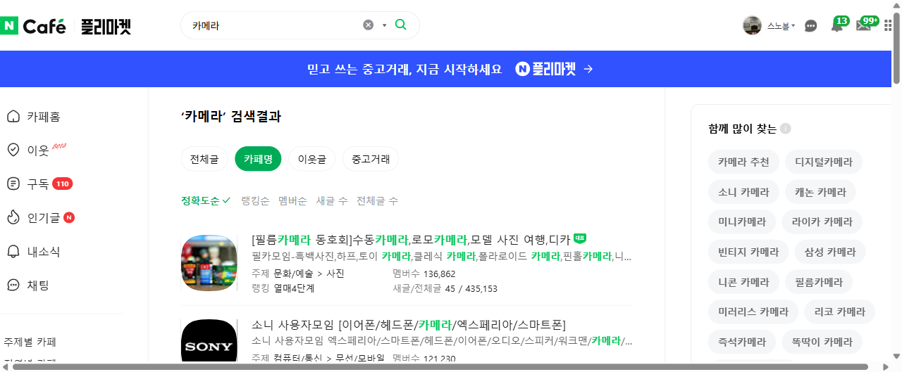
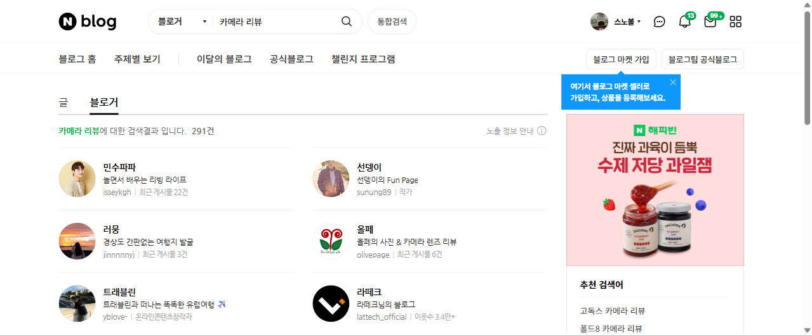
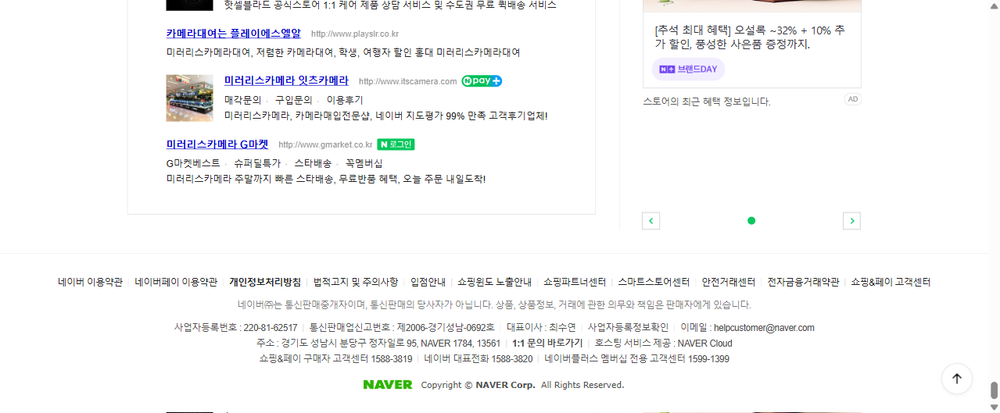

# 카메라 입문자를 위한 네이버 커뮤니티 지도 & 인기 디지털카메라 리서치

> **조사 일시**: 2026-09-06
> **조사 도구**: Playwright 브라우저 자동화 (네이버 카페검색 / 네이버 블로그 / 네이버 쇼핑)
> **주제**: "카메라 정보를 어디서 얻고, 지금 한국에서 잘 팔리는 디지털카메라는 무엇인가"

카메라를 처음 사려는 사람이 부딪히는 문제는 정보가 없는 게 아니라 **정보가 너무 많다는 것**이다.
그래서 이 리포트는 두 단계로 접근했다.

1. **어디서 보나** — 네이버 카페·블로그 중 실제로 사람이 모여 있고 글이 올라오는 곳을 멤버 수 기준으로 추린다.
2. **무엇을 사나** — 그 커뮤니티들이 다루는 기종이 실제 시장에서도 팔리는지를 네이버 쇼핑 **리뷰 수**로 교차 검증한다.

---

## 📚 Part 1. 카메라 정보를 얻는 네이버 카페

`section.cafe.naver.com` 카페 검색에서 `카메라`, `미러리스` 두 키워드로 수집한 결과를 **멤버 수 내림차순**으로 정리했다.

### 1-1. 브랜드별 대표 카페 (기종 질문·중고거래·펌웨어 정보)

| 순위 | 카페명 | 멤버 수 | 주제 | 이런 걸 얻는다 | 주소 |
| --- | --- | ---: | --- | --- | --- |
| 1 | **[소니 미러리스 클럽]** | **288,564** | 문화/예술 > 사진 | 국내 최대 카메라 카페. a7 V·a7C II·a6700·FX3 II 등 소니 알파 전 기종 실사용기와 중고 시세 | https://cafe.naver.com/nex3nex5 |
| 2 | **디갤 (DSLR·미러리스 중고)** | **224,973** | 문화/예술 > 사진 | 브랜드를 가리지 않는 중고 거래·기종 추천. 사진 분야 구인구직 게시판도 있음 | https://cafe.naver.com/temadica |
| 3 | **캐논클럽** | **173,034** | 문화/예술 > 사진 | 캐논 대표카페. R50·R8·R6·R7·R10 등 EOS R 라인업 정보와 출사·교육 | https://cafe.naver.com/canon450dclub |
| 4 | **후지피플** | **135,450** | 문화/예술 > 사진 | 12년 연속 네이버 대표카페. X-T5·X100VI·X-T50·X half 등 후지 감성 유저층 | https://cafe.naver.com/fujipeople |
| 5 | **소니 사용자모임** | **121,230** | 컴퓨터/통신 > 무선 | 카메라 + 이어폰/엑스페리아까지 다루는 소니 종합 사용자 모임 | https://cafe.naver.com/x1smart |
| 6 | **캐논미러리스클럽** | **92,271** | 문화/예술 > 사진 | 캐논 중심이지만 소니·니콘 강의도 진행. 사진 교육 비중이 높음 | https://cafe.naver.com/dicawith |
| 7 | **라이프스케치 (올림푸스/OM)** | **24,140** | 문화/예술 > 사진 | OM-D·PEN 등 마이크로포서드 공식 커뮤니티 | https://cafe.naver.com/witholy |
| 8 | **니콘피플** | **14,863** | 문화/예술 > 사진 | 니콘 미러리스(Zf·Z5 II·Z6) 커뮤니티. 규모 대비 새 글이 많음(하루 70여 건) | https://cafe.naver.com/nikonpeople |
| 9 | **펜탁시안의 라이브뷰** | **4,378** | 문화/예술 > 사진 | 국내에서 몇 안 남은 펜탁스 K 시리즈 사용자 모임 | https://cafe.naver.com/pentaxianstyle |

### 1-2. 취미·장르 중심 카페 (사진을 배우고 같이 찍는 곳)

| 카페명 | 멤버 수 | 특징 | 주소 |
| --- | ---: | --- | --- |
| **DOF LOOK** | 141,892 | 영상 촬영 커뮤니티. 시네마 카메라·짐벌·색보정 정보가 강함 | https://cafe.naver.com/doflook |
| **필름카메라 동호회** | 136,862 | 수동·하프·토이·폴라로이드 등 필름 전반. 최근 필름 감성 유행의 진원지 | https://cafe.naver.com/35mmcamera |
| **네이버 카메라를메라** | 63,434 | "12주 완성 사진초보 탈출" 커리큘럼형 공식 카페. 완전 입문자용 | https://cafe.naver.com/cameramera |
| **사랑을 담는 사진사** | 18,674 | 브랜드 무관 종합 동호회, 출사·강습 중심 | https://cafe.naver.com/nikond40 |
| **토담쓰담** | 17,669 | 무료 사진강좌·스튜디오 제공·모델 촬영회 | https://cafe.naver.com/todamssudam |
| **사진공감** | 7,759 | 무료 초급 강좌와 해외 출사 프로그램 | https://cafe.naver.com/photosympathy |

> **입문자 동선 추천**
> ① `카메라를메라`에서 용어와 노출 기초를 잡고 →
> ② 관심 브랜드 카페(소미클/캐논클럽/후지피플/니콘피플)에서 실사용 후기를 읽고 →
> ③ `디갤`에서 중고 시세를 확인한 뒤 구매한다.

---

## ✍️ Part 2. 카메라 정보를 얻는 네이버 블로그

### 2-1. 제조사 공식 블로그 (신제품·펌웨어·정품 정보의 1차 출처)

| 블로그 | 운영 주체 | 주소 |
| --- | --- | --- |
| **소니코리아** | 소니코리아 공식 | https://blog.naver.com/sonykorea |
| **캐논코리아 주식회사 블로그** | 캐논코리아 공식 | https://blog.naver.com/canonkoreacamera |
| **니콘 공식 블로그** | 니콘이미징코리아 공식 | https://blog.naver.com/nikonimagingkorea |

> 후지필름은 카메라 부문 공식 블로그 대신 **카페 `후지피플`**(13.5만 명)이 사실상 공식 창구 역할을 한다.
> 검색되는 `fujifilm_bi_kr`은 프린터·복합기를 다루는 비즈니스이노베이션 부문이라 카메라 정보와 무관하다.

### 2-2. 카메라·렌즈 리뷰 전문 블로그

네이버 블로그 **블로거 검색**(`카메라 리뷰`)에서, 블로그 이름 자체에 카메라/렌즈 리뷰를 내건 곳만 골랐다.
검색 결과 상단은 협찬성 생활 블로그가 많아 **"블로그명에 카메라·렌즈·사진이 들어가는가"**를 1차 필터로 사용했다.

| 블로그명 | 아이디 | 다루는 것 |
| --- | --- | --- |
| 올페의 사진 & 카메라 렌즈 리뷰 | `olivepage` | 바디보다 **렌즈** 리뷰 비중이 높음 |
| StrongArm의 카메라/렌즈 리뷰 블로그 | `strongarmrev` | 스펙 위주의 정공법 리뷰 |
| cyoz 테크스냅 (카메라·IT 리뷰) | `lskimch` | 카메라 + IT 기기를 함께 다룸 |
| 가을눈스냅 & 카메라, 렌즈 리뷰 | `shiny_ss` | 스냅 작가 시점의 실전 작례 |
| 아둥스 (카메라와 함께하는 리뷰) | `ramiebbo` | 생활 밀착형 사용기, 업로드가 잦음 |
| 장비그래퍼: IT·카메라 리뷰 / 네오루나 | `neolunar` | 포토·비디오그래퍼의 영상 장비 관점 |
| Jeju Sonais Photoworks | `avecjh` | 제주 풍경 작례 중심(이웃 8천+) |
| Digital Photography & Analogue Emotion | `dpiw` | 디지털/아날로그 감성 비교 |
| 잇츠카메라 가이드 | `itscamera_official` | **중고 카메라 매입·시세** 정보 |
| 카메라를 메라 | `herodkr` | 동명 공식 카페 운영자의 입문 강의형 포스팅 |

> ⚠️ **읽을 때 주의**: 네이버 블로그의 카메라 검색 상위는 협찬·제휴 링크 글이 섞여 있다.
> 본문 하단의 `#협찬`, `#체험단`, 쿠팡 파트너스 고지를 먼저 확인하고, **작례 원본을 올리는 블로그**를 우선으로 보는 게 안전하다.

---

## 🏆 Part 3. 지금 인기 있는 디지털카메라

네이버 쇼핑(가격비교)에서 **`리뷰 많은 순`**으로 정렬해 수집했다.
렌탈·대여 상품과 판매처 자체 패키지 상품은 제외하고 **브랜드 카탈로그(정품 바디/킷) 기준**으로만 순위를 매겼다.
리뷰 수는 "지금 많이 사고 있다"는 뜻이므로, 커뮤니티에서 화제인 기종과 실제 판매를 함께 볼 수 있다.

### 3-1. 렌즈교환식(미러리스) TOP 10 — 리뷰 많은 순

| 순위 | 모델 | 최저가 | 별점 | 리뷰 수 | 한 줄 평 |
| ---: | --- | ---: | :---: | ---: | --- |
| 🥇 1 | **소니 A7C II** (바디) | 2,108,650원 | 4.95 | **2,246** | 2위와 3배 차이. 풀프레임을 콤팩트 바디에 넣은 조합이 압도적 1위 |
| 🥈 2 | **후지필름 X-T5** (바디) | 2,189,990원 | 4.97 | 755 | 4천만 화소 APS-C + 다이얼 조작. 후지 감성의 대표 기종 |
| 🥉 3 | **캐논 EOS R6 Mark II** (바디) | 2,266,990원 | 4.95 | 592 | 40매/초 연사. 스포츠·행사 촬영의 표준 |
| 4 | **후지필름 X-M5** (15-45 킷) | 1,299,000원 | 4.96 | 564 | 뷰파인더를 빼고 가격을 낮춘 입문 후지. 필름 시뮬레이션 다이얼 탑재 |
| 5 | **후지필름 X-T50** (바디) | 1,723,670원 | 4.96 | 446 | X-T5의 화소·필름시뮬을 물려받은 중급기 |
| 6 | **후지필름 X-E5** (XF23mm 킷) | 2,349,000원 | 4.96 | 426 | 레인지파인더 스타일. 단렌즈 킷으로 바로 시작 |
| 7 | **후지필름 X-T30 III** (바디) | 1,326,000원 | 4.99 | 403 | 별점 4.99, 상위권 중 최고 만족도 |
| 8 | **캐논 EOS R10** (18-45 킷) | 860,000원 | 4.95 | 395 | **100만 원 아래 유일한 상위권**. 렌즈교환식 입문 1순위 |
| 9 | **소니 A7 IV** (바디) | 2,177,990원 | 4.95 | 389 | 후속(A7 V) 출시 후에도 가성비로 계속 팔리는 스테디셀러 |
| 10 | **소니 A6700** (바디) | 1,508,400원 | 4.91 | 379 | APS-C 플래그십. 영상 스펙이 강함 |

**11위 이하 주요 기종**

| 모델 | 최저가 | 리뷰 수 | 포인트 |
| --- | ---: | ---: | --- |
| 캐논 EOS R8 | 1,722,990원 | 357 | 가장 싼 풀프레임 미러리스 축 |
| 소니 ZV-E10 II | 1,169,410원 | 327 | 브이로그 전용 설계 |
| 소니 A7CR | 3,172,050원 | 321 | 6100만 화소 콤팩트 풀프레임 |
| 니콘 Zf (40mm SE 킷) | 2,790,000원 | 284 | 필름 카메라 외관의 풀프레임 |
| 니콘 Z fc (16-50 킷) | 1,020,000원 | 261 | Zf의 APS-C 버전, 100만 원대 초반 |
| 니콘 Z f (바디) | 2,440,000원 | 228 | 별점 4.99 |
| 소니 A7 V | 3,125,500원 | 224 | 최신 플래그십 스탠더드기 |
| 니콘 Z5 II | 2,077,740원 | 213 | 니콘 풀프레임 입문 |
| 후지필름 X-S20 | 1,618,840원 | 208 | 손떨림 보정 + 영상 |

### 3-2. 컴팩트·하이엔드 디카 TOP 10 — 리뷰 많은 순

| 순위 | 모델 | 최저가 | 별점 | 리뷰 수 | 한 줄 평 |
| ---: | --- | ---: | :---: | ---: | --- |
| 🥇 1 | **캐논 파워샷 V1** | 1,139,650원 | 4.91 | **657** | 1.4형 센서 + 광각 줌. 브이로그 컴팩트의 새 기준 |
| 🥈 2 | **리코 GR III** | 1,980,000원 | 4.94 | 423 | 스냅 카메라의 대명사. 단종 이슈로 가격이 오히려 상승 |
| 🥉 3 | **캐논 G7X Mark III** | 1,229,000원 | 4.92 | 341 | 유튜버 표준 디카. 출시 6년이 넘도록 상위권 |
| 4 | **리코 GR IV 모노크롬** | 2,990,000원 | 4.95 | 308 | 흑백 전용 센서 한정판 |
| 5 | **캐논 파워샷 V10** | 516,200원 | 4.85 | 254 | 50만 원대 세로형 브이로그 카메라 |
| 6 | **소니 ZV-1 II** | 897,890원 | 4.92 | 225 | 18mm 초광각, 1인 촬영 특화 |
| 7 | **후지필름 X half** | 798,000원 | 4.93 | 216 | 하프 프레임 감성. 2026년 최대 화제작 |
| 8 | **리코 GR III Street Edition** | 1,819,900원 | 4.91 | 175 | GR III 스트리트 스냅 에디션 |
| 9 | **소니 RX100 VII** | 1,590,000원 | 4.93 | 108 | 1형 센서 하이엔드의 오랜 기준점 |
| 10 | **니콘 P950** | 898,990원 | 4.83 | 89 | 83배 초망원 하이브리드 |

> 저가 노네임 "빈티지 디카"(5만~14만 원대 RUNHome 등)도 리뷰 90~300건대로 상위에 올라온다.
> 화질보다 **필름 느낌·가벼움·가격**을 사는 수요가 별도로 존재한다는 신호다.

---

## 📈 Part 4. 데이터에서 읽히는 5가지 흐름

### 1. 후지필름이 리뷰 순위를 점령했다

미러리스 TOP 10 중 **5개가 후지필름**(X-T5, X-M5, X-T50, X-E5, X-T30 III)이다.
카페 규모는 소니(28.8만)가 후지(13.5만)의 두 배지만, **실제 구매 리뷰는 후지가 더 많이 쌓인다.**
"카페는 소니, 지갑은 후지"라는 비대칭이 이번 조사의 가장 흥미로운 지점이다.

### 2. 풀프레임은 '작아져야' 팔린다

1위 A7C II와 상위권 A7CR은 모두 **콤팩트 풀프레임**이다.
같은 센서를 쓰는 큰 바디보다 작은 바디의 리뷰가 훨씬 많다.

### 3. 브이로그·콘텐츠 제작용이 하나의 독립 카테고리가 됐다

컴팩트 1위 파워샷 V1, 5위 V10, 6위 ZV-1 II, 미러리스 12위 ZV-E10 II —
**사진기가 아니라 촬영 장비로 설계된 기종**이 각 순위권에 고르게 들어와 있다.

### 4. 레트로·필름 감성이 신제품을 움직인다

후지 X half(216), 리코 GR IV 모노크롬(308), 니콘 Zf/Z fc(284/261),
그리고 멤버 13.6만 명의 필름카메라 동호회까지. **불편함을 콘셉트로 파는 제품**이 실제로 팔린다.

### 5. "빌려보고 산다"가 정착했다

리뷰 상위권에 카메라 **대여 상품**이 다수 섞여 있다(R6 II 세트 694건, GR3x 392건, GR3 344건).
100만~300만 원대 지출 전에 1일 1만~6만 원으로 검증하는 구매 패턴이 자리 잡았다.

---

## 🎯 Part 5. 이렇게 고르면 된다 (용도별 정리)

| 상황 | 추천 기종 | 대략 예산 | 먼저 볼 커뮤니티 |
| --- | --- | ---: | --- |
| 렌즈교환식 완전 입문 | 캐논 EOS R10 18-45 킷 | 86만 원 | 캐논클럽 · 카메라를메라 |
| 사진 감성·색감 우선 | 후지필름 X-M5 / X-T30 III | 130만 원대 | 후지피플 |
| 여행 한 대로 끝내기 | 소니 A7C II | 210만 원 | 소니 미러리스 클럽 |
| 유튜브·브이로그 | 캐논 파워샷 V1 / 소니 ZV-E10 II | 110만 원대 | DOF LOOK |
| 매일 들고 다니는 스냅 | 리코 GR III / 후지 X half | 80만~200만 원 | 필름카메라 동호회 · 디갤 |
| 행사·스포츠·인물 | 캐논 EOS R6 Mark II | 227만 원 | 캐논클럽 · 캐논미러리스클럽 |
| 예산을 아끼고 싶다 | 중고 A7 III / X-T30 / EOS R | — | 디갤 · 잇츠카메라 가이드 |

---

## 🔍 데이터 출처와 한계

**수집 경로**

| 항목 | 출처 | 방법 |
| --- | --- | --- |
| 카페 멤버 수·주제 | 네이버 카페 검색 (`section.cafe.naver.com`) | `카메라`, `미러리스` 키워드 검색 결과 파싱 |
| 블로그 목록 | 네이버 블로그 블로거 검색 / 통합 블로그 검색 | `카메라`, `카메라 리뷰`, 브랜드명 + `공식블로그` |
| 카메라 순위·가격 | 네이버 쇼핑 가격비교 | `미러리스 카메라`, `하이엔드 디지털카메라` → **리뷰 많은 순** 정렬 |

**한계**

- 리뷰 수는 **누적값**이라 오래된 기종이 유리하다. 신제품(A7 V, 니콘 Z5 II)은 실제 인기 대비 과소평가될 수 있다.
- 네이버 쇼핑은 같은 기종이 바디/킷/판매처 패키지로 나뉘어 리뷰가 분산된다. 여기서는 **브랜드 카탈로그 단위**만 집계했다.
- 카페 멤버 수는 누적 가입자 수이므로 활동량과 다르다. 예를 들어 니콘피플은 멤버 1.5만 명이지만 새 글이 하루 70여 건으로 밀도가 높다.
- 가격은 2026-09-06 기준 최저가이며 수시로 변동한다.

---

## 📎 함께 보는 파일

| 파일 | 설명 |
| --- | --- |
| `index.html` | 이 리포트를 소개하는 웹페이지 (React 18 + Tailwind 단일 파일) |
| `웹페이지-미리보기.png` | 완성된 웹페이지의 인기 카메라 순위 화면 |
| `수집과정_네이버카페검색.png` | 네이버 카페 검색 수집 화면 |
| `수집과정_네이버블로그검색.png` | 네이버 블로거 검색 수집 화면 |
| `수집과정_네이버쇼핑_미러리스_리뷰순.png` | 네이버 쇼핑 리뷰 많은 순 정렬 화면 |
