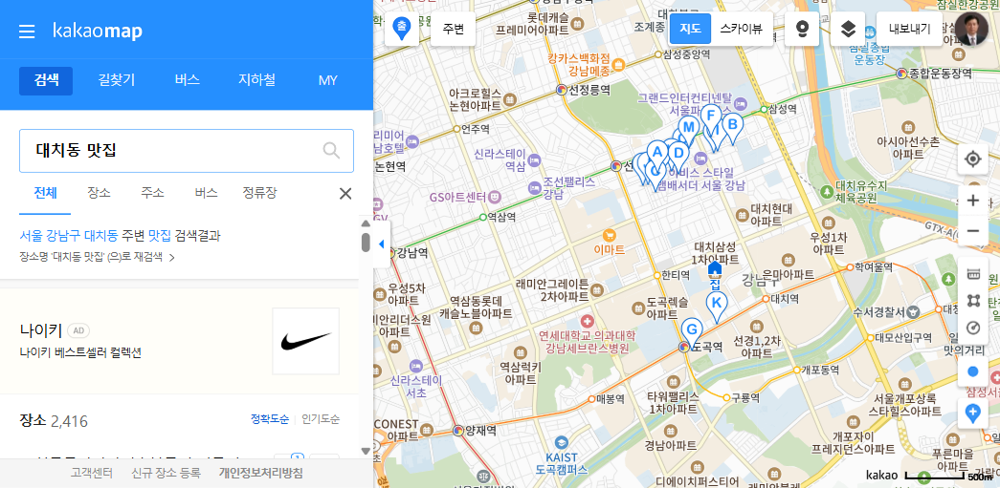

# 대치동 맛집 TOP 5 (리뷰 많은 순)

> **조사 일시**: 2026-09-05
> **출처**: [카카오맵](https://map.kakao.com/) — Playwright 브라우저 자동화로 수집
> **정렬 기준**: 카카오맵 **리뷰 수**(후기 개수) 내림차순
> **대상**: 지번 주소가 `강남구 대치동`인 음식점

---

## 🥇 1위. 진대감 선릉점

| 항목 | 내용 |
| --- | --- |
| 리뷰 수 | **3,059** |
| 별점 | ⭐ 4.7 (268건) |
| 분류 | 육류·고기 |
| 주소 | 서울 강남구 테헤란로70길 25 101호 (지번: 대치동 895-11) |
| 전화 | 02-564-1253 |
| 영업시간 | 토·일 11:30 ~ 21:30 |
| 카카오맵 | https://place.map.kakao.com/26565017 |

리뷰 수 3천 건을 넘긴 압도적 1위. 별점도 4.7로 높아 **"많이 가고 만족도도 높은"** 조합.
선릉역 일대 회식·점심 수요를 그대로 흡수하는 대표 고깃집이다.

## 🥈 2위. 농민백암순대 본점

| 항목 | 내용 |
| --- | --- |
| 리뷰 수 | **1,540** |
| 별점 | ⭐ 4.5 (857건) |
| 분류 | 국밥 |
| 주소 | 서울 강남구 선릉로86길 40-4 알앤지타운 1층 (지번: 대치동 896-33) |
| 전화 | 02-555-9603 |
| 영업시간 | 토 11:10 ~ 15:30 (라스트오더 15:00) |
| 카카오맵 | https://place.map.kakao.com/17163273 |

평점 참여자 수(857건)가 TOP5 중 가장 많다. 순대국밥 단일 메뉴로 오랜 기간 쌓아온 신뢰도가 특징.
영업시간이 짧은 편이라 방문 전 확인 필수.

## 🥉 3위. 중앙해장

| 항목 | 내용 |
| --- | --- |
| 리뷰 수 | **1,405** |
| 별점 | ⭐ 4.1 (808건) |
| 분류 | 해장국 |
| 주소 | 서울 강남구 영동대로86길 17 육인빌딩 1층 (지번: 대치동 996-16) |
| 전화 | 02-558-7905 |
| 영업시간 | 화~토 24시간 영업 |
| 카카오맵 | https://place.map.kakao.com/27531028 |

**24시간 영업**이라 새벽·심야 수요까지 잡는다. 리뷰가 계속 쌓이는 구조.
은마아파트·삼성역 생활권에서 접근성이 좋다.

## 4위. 셀러브리티버거

| 항목 | 내용 |
| --- | --- |
| 리뷰 수 | **1,383** |
| 별점 | ⭐ 4.1 (82건) |
| 분류 | 햄버거 |
| 주소 | 서울 강남구 도곡로63길 25 서진빌딩 1층 (지번: 대치동 923-13) |
| 전화 | 0503-7150-5183 |
| 영업시간 | 화~일 11:30 ~ 21:10 (라스트오더 20:30) |
| 카카오맵 | https://place.map.kakao.com/853722638 |

TOP5 중 유일한 수제버거집. 리뷰 1,383건 대비 별점 참여는 82건으로,
**"평점보다 리뷰(후기 글)가 훨씬 많은"** 유형 — 학원가 학생·직장인 방문이 많은 곳으로 보인다.

## 5위. 신동궁감자탕뼈숯불구이 선릉직영점

| 항목 | 내용 |
| --- | --- |
| 리뷰 수 | **1,233** |
| 별점 | ⭐ 3.8 (295건) |
| 분류 | 감자탕 |
| 주소 | 서울 강남구 선릉로86길 39 1층 (지번: 대치동 890-44) |
| 전화 | 02-558-7944 |
| 영업시간 | 매일 24시간 영업 |
| 카카오맵 | https://place.map.kakao.com/11356521 |

역시 **24시간 영업**. 별점은 3.8로 TOP5 중 가장 낮지만 방문량이 많아 리뷰가 크게 쌓였다.
"리뷰 수 = 인기"와 "별점 = 만족도"가 항상 같지 않다는 걸 보여주는 사례.

---

## 한눈에 보기

| 순위 | 이름 | 분류 | 리뷰 수 | 별점 (참여) |
| --- | --- | --- | ---: | --- |
| 1 | 진대감 선릉점 | 육류·고기 | 3,059 | 4.7 (268) |
| 2 | 농민백암순대 본점 | 국밥 | 1,540 | 4.5 (857) |
| 3 | 중앙해장 | 해장국 | 1,405 | 4.1 (808) |
| 4 | 셀러브리티버거 | 햄버거 | 1,383 | 4.1 (82) |
| 5 | 신동궁감자탕뼈숯불구이 선릉직영점 | 감자탕 | 1,233 | 3.8 (295) |

### 아깝게 놓친 6~10위

| 순위 | 이름 | 분류 | 리뷰 수 | 별점 (참여) |
| --- | --- | --- | ---: | --- |
| 6 | 이가네양꼬치 선릉점 | 양꼬치 | 983 | 4.0 (31) |
| 7 | 돌산등대집 | 한식 | 879 | 4.4 (76) |
| 8 | 논두렁오리주물럭 선릉직영점 | 오리 | 824 | 4.9 (726) |
| 9 | 대치동집 | 삼겹살 | 796 | 3.7 (32) |
| 10 | 보노보노 삼성점 | 뷔페 | 776 | 4.1 (127) |

> 💡 **별점까지 본다면**: 8위 **논두렁오리주물럭**이 별점 4.9(726건 참여)로 조사 대상 전체에서 가장 높다.
> 리뷰 수는 5위권 밖이지만 만족도 기준으로는 최상위권.

---

## 조사 방법 (Playwright 자동화)

1. `map.kakao.com` 접속 후 **대치역**을 검색해 지도 중심을 대치동으로 이동
2. 지도 중심 기준으로 14개 키워드를 순차 검색 — `대치동 맛집`, `대치동 음식점`, `맛집`, `고기`,
   `한식`, `일식`, `중식`, `양식`, `분식`, `은마아파트 맛집`, `대치동 학원가 맛집`,
   `삼성로 맛집`, `도곡로 맛집`, `대치사거리 맛집`
3. 검색 결과 리스트(`#info.search.place.list`)에서 상호·분류·별점·리뷰 수·주소·전화·영업시간을 파싱
4. 상호+주소 기준으로 중복 제거 → 후보 **142곳** 수집
5. 지번 주소에 `대치동`이 포함된 곳만 필터 → **97곳**
6. 리뷰 수 내림차순 정렬 후 상위 5곳 선정

### 한계

- 카카오맵 웹 검색은 키워드당 결과가 15건으로 제한되어, 여러 키워드를 조합해 후보군을 넓혔다.
  키워드에 걸리지 않은 대치동 음식점이 누락됐을 가능성이 있다.
- 카카오맵에는 "리뷰 많은 순" 정렬 옵션이 없어, 수집한 데이터를 직접 정렬했다.
- **리뷰 수**(후기 글 개수)와 **별점 참여 수**는 서로 다른 지표다. 이 문서의 순위는 리뷰 수 기준.
- 리뷰 수·별점·영업시간은 2026-09-05 기준 스냅샷이며 이후 변동될 수 있다.
