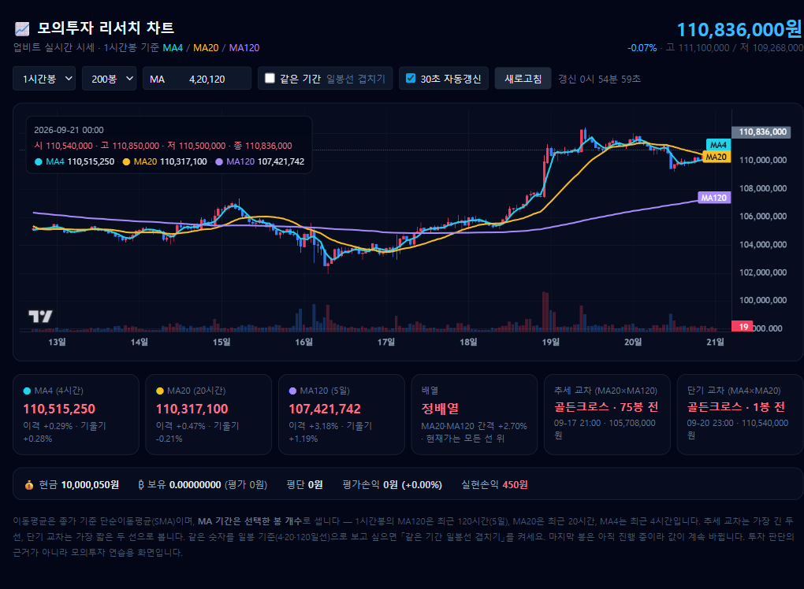

# 퀘스트 8. 모의투자 리서치 에이전트

week-4 「퀘스트 1. 나만의 모의투자 앱」 계좌를 그대로 쓰면서, **업비트 실시간 시세로
1시간봉 이동평균선(MA4 · MA20 · MA120)을 그리고 지금 위치를 읽어 주는** 에이전트 스킬.



## 빠르게 실행

```bash
cd "week-5/project/퀘스트 8. 모의투자 리서치 에이전트"

# 1) 터미널에서 현재 상태만 보기 (서버 불필요)
node scripts/fetch-candles.js

# 2) 차트 화면 띄우기 → http://localhost:3100
node server.js
```

설치할 의존성이 없다. Node 18 이상의 내장 `fetch` 와 `http` 만 쓴다.

week-4 모의투자 앱(`http://localhost:3000`)을 같이 띄워 두면 보유 수량·평단·손익이
화면 아래에 붙고, **평균 매수가가 차트에 초록 점선으로** 그려진다. 꺼져 있어도 차트는 그대로 동작한다.
앱을 다른 포트에 띄웠다면 `TRADER_API=http://localhost:4000 node server.js` 처럼 알려준다.

## 이 폴더

| 파일 | 역할 |
|---|---|
| `SKILL.md` | 에이전트 스킬 본문 (설치본은 `.claude/skills/paper-trade/SKILL.md`) |
| `lib/upbit.js` | 업비트 캔들·시세 수집, 단순이동평균, 배열·이격·크로스 판정 |
| `scripts/fetch-candles.js` | 스냅샷 CLI — `data/` 에 JSON 저장 + 한글 요약 출력 |
| `server.js` | 차트 서버 (기본 3100) — 업비트 호출과 지갑 조회를 서버가 대신 한다 |
| `index.html` | 캔들 + MA4/MA20/MA120 + 거래량 차트 (TradingView Lightweight Charts) |
| `data/` | 수집 스냅샷. `latest.json` 은 항상 최신 |
| `journal/` | 매매일지 `YYYY-MM-DD.md` |

## MA 기간을 세는 단위

**이동평균 기간은 "봉 개수"로 센다.** 1시간봉 기준
**MA120 = 최근 120시간(5일)**, **MA20 = 최근 20시간**, **MA4 = 최근 4시간**이다.

세 선은 역할이 다르다 — **MA120 추세의 바닥 · MA20 추세의 허리 · MA4 지금 이 순간**.
그래서 교차도 두 가지로 나눠 본다.

| 교차 | 보는 선 | 뜻 |
|---|---|---|
| 추세 교차 | 가장 긴 두 선 (MA20 × MA120) | 추세가 바뀐 자리 |
| 단기 교차 | 가장 짧은 두 선 (MA4 × MA20) | 진입·청산 타이밍 자리 |

같은 숫자를 일봉 기준(4·20·120일선)으로도 보고 싶으면 화면의
**「같은 기간 일봉선 겹치기」** 를 켜면 점선으로 함께 그려지고, 터미널에서는 `--unit day` 를 쓴다.
화면의 `MA` 입력칸(또는 `--ma`)에 쉼표로 기간을 적어 선을 늘리거나 줄일 수 있다.

```bash
node scripts/fetch-candles.js --unit day --ma 4,20,120
node scripts/fetch-candles.js --count 400 --ma 4,20,60,120   # 봉 수·기간 바꾸기
```

## 실행 예시

```
$ node scripts/fetch-candles.js
저장: data/KRW-BTC_1시간봉_202609210000.json
[KRW-BTC] 1시간봉 200봉 · 기준시각 2026-09-21 00:00:00 KST
현재가 110,796,000원
MA4 (4시간) 110,505,250원 · 이격 +0.26% · 기울기 +0.27%
MA20 (20시간) 110,315,100원 · 이격 +0.44% · 기울기 -0.21%
MA120 (5일) 107,421,408원 · 이격 +3.14% · 기울기 +1.19%
배열 정배열 (MA20이 MA120보다 +2.69%) · 현재가는 모든 선 위
추세 MA20×MA120 골든크로스: 2026-09-17 21:00:00 (75봉 전, 105,708,000원)
단기 MA4×MA20 골든크로스: 2026-09-20 23:00:00 (1봉 전, 110,540,000원)
```

## 설계 메모

- **브라우저는 자기 서버(`/api`)만 호출한다.** 업비트 공개 API 는 키가 필요 없지만,
  외부 도메인 호출과 계좌 조회는 전부 서버가 대신한다.
- **정적 폴더를 통째로 서빙하지 않고** `index.html` 만 명시적으로 내보낸다.
  폴더를 통째로 노출하면 같은 폴더의 설정 파일까지 URL 로 새어나간다.
- 업비트 캔들은 한 번에 200봉이 최대다. MA120을 200봉 전부에 채우려면 319봉이 필요하므로
  `to` 파라미터로 과거 쪽으로 이어 받고, 경계에서 겹치는 봉은 시각으로 중복 제거한다.
- 차트 시간축은 KST 로 읽히도록 `candle_date_time_kst` 를 초 단위로 바꿔 쓴다.
- 마지막 봉은 아직 진행 중이므로 값이 계속 바뀐다. 크로스 확정은 한 봉 마감 후에 한다.

모의투자 연습용 화면이며 투자 판단의 근거가 아니다.
